The image collection contains symbolic theology, visual metaphors, and diagrammatic material. The canonical catalog is also available as [Gallery Catalog](markdown/gallery.md).

::: {.grid}
::: {.g-col-12 .g-col-md-6}
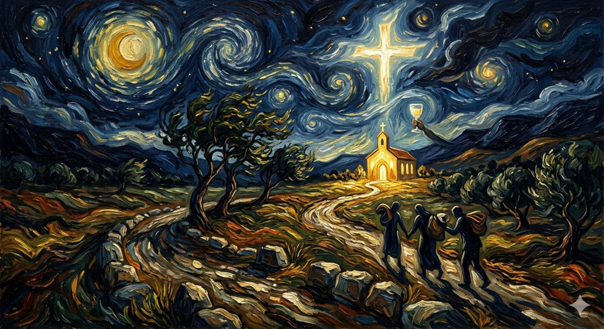

### Starry Road to the Church

A painted night landscape with travelers moving toward a lit church under a cross-filled sky.
:::

::: {.g-col-12 .g-col-md-6}
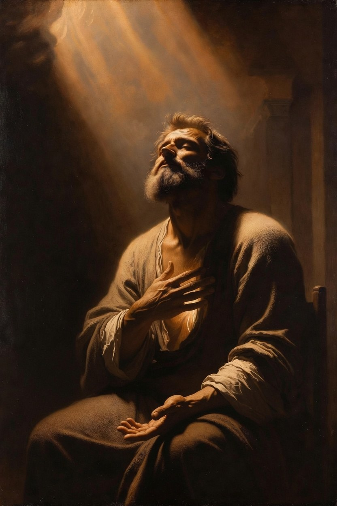

### Ceaseless Prayer

A prayerful figure rests beneath descending light, evoking the soul's continuous orientation toward God.
:::

::: {.g-col-12 .g-col-md-6}
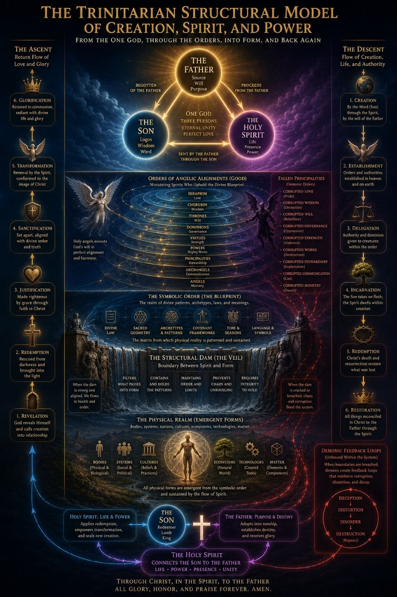

### The Trinitarian Structural Model

A dense theological diagram of creation, symbolic order, fallen principalities, redemption, and restoration.
:::

::: {.g-col-12 .g-col-md-6}
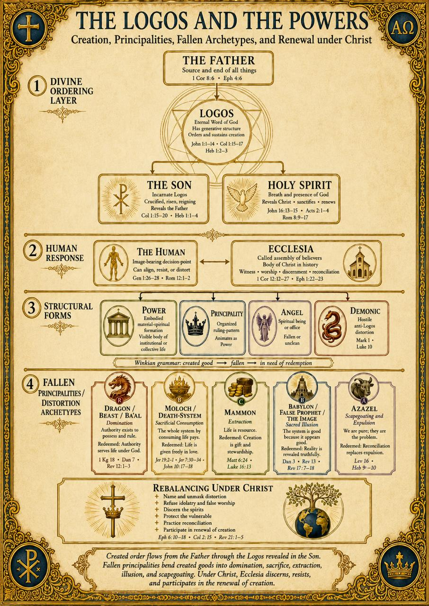

### Divine Ordering and Human Response

A theological systems diagram linking divine ordering, human response, ecclesia, structural forms, and distortion archetypes.
:::

::: {.g-col-12 .g-col-md-6}
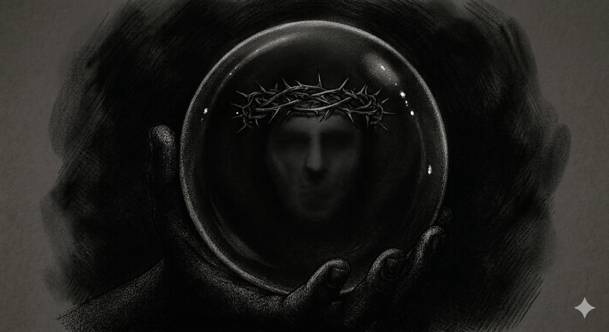

### Dark Mirror with Crown of Thorns

A shadowed hand holds a dark reflective sphere containing a faint face crowned with thorns.
:::

::: {.g-col-12 .g-col-md-6}
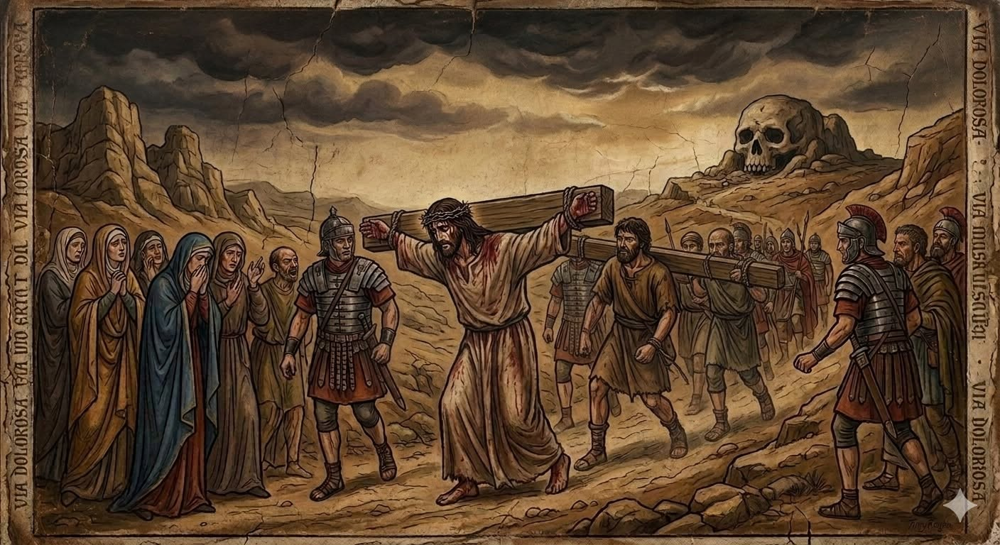

### Via Dolorosa

Christ carries the cross through a barren road under storm clouds, surrounded by soldiers and mourning followers.
:::

::: {.g-col-12 .g-col-md-6}
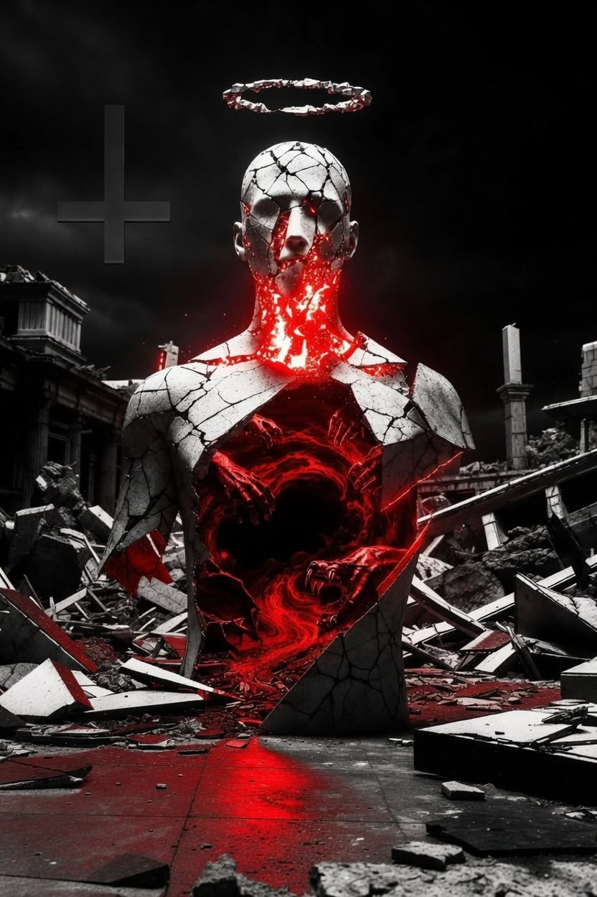

### Cracked Idol with Red Void

A cracked statue-like figure stands among ruins with a dark red hollow in its chest.
:::

::: {.g-col-12 .g-col-md-6}
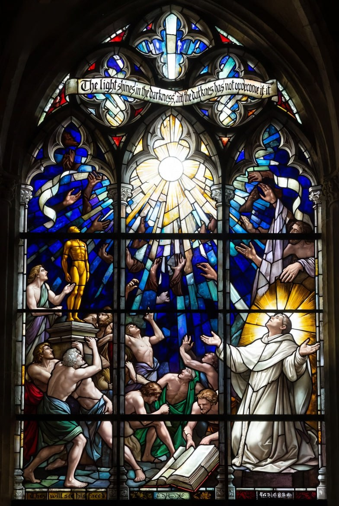

### The Ungraspable Light

A stained-glass meditation on John 1:5, with uncreated light breaking through human grasping, idolatry, and theological surrender.
:::

::: {.g-col-12 .g-col-md-6}
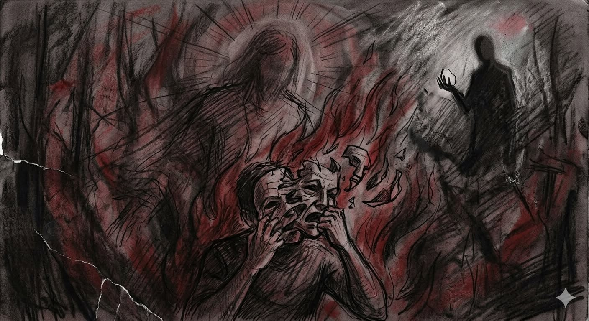

### Burning Mask and Shadow Figure

A distressed figure tears at a fractured mask as red flames rise around them.
:::

::: {.g-col-12 .g-col-md-6}
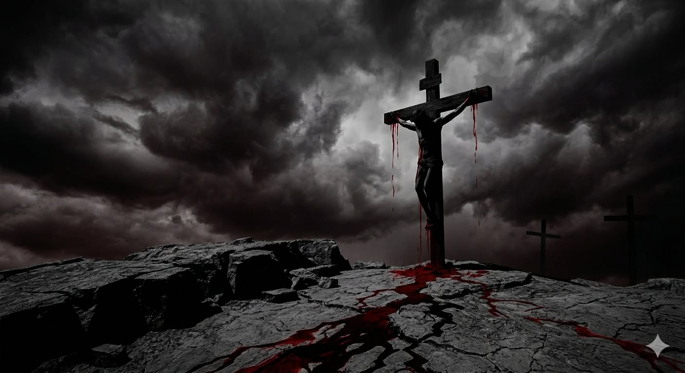

### Crucifixion Under Storm Clouds

A solitary crucifix rises from cracked stone beneath heavy storm clouds.
:::

::: {.g-col-12 .g-col-md-6}
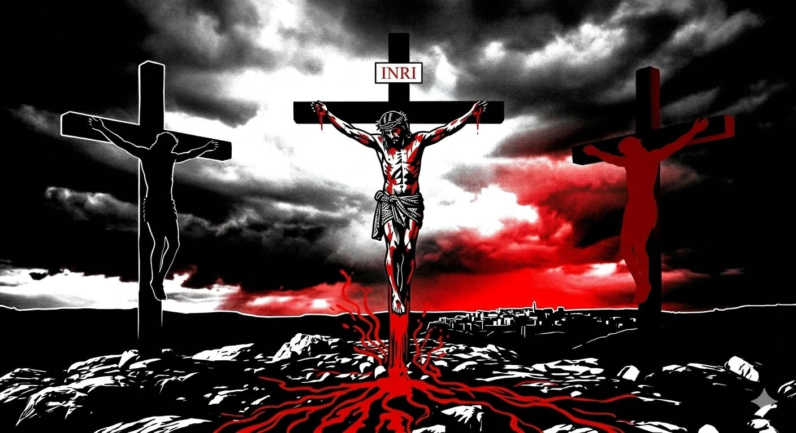

### Three Crosses at Calvary

A graphic depiction of the crucifixion with three crosses, storm clouds, an INRI inscription, and red streams.
:::

::: {.g-col-12 .g-col-md-6}
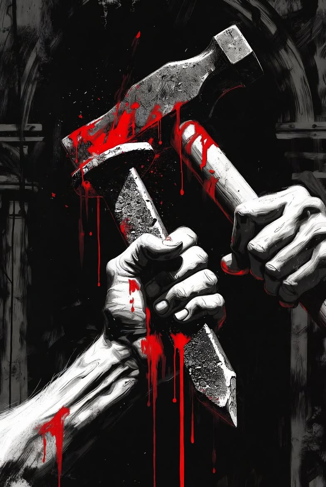

### Hammer and Knife with Blood

Two hands grip a hammer and knife in a stark black, white, and red composition.
:::

::: {.g-col-12 .g-col-md-6}
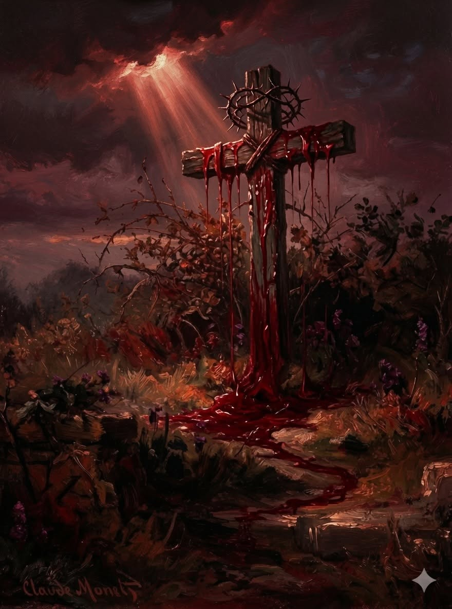

### Blood-Drenched Crowned Cross

A crown of thorns hangs on a wooden cross in a dark garden-like setting.
:::

::: {.g-col-12 .g-col-md-6}
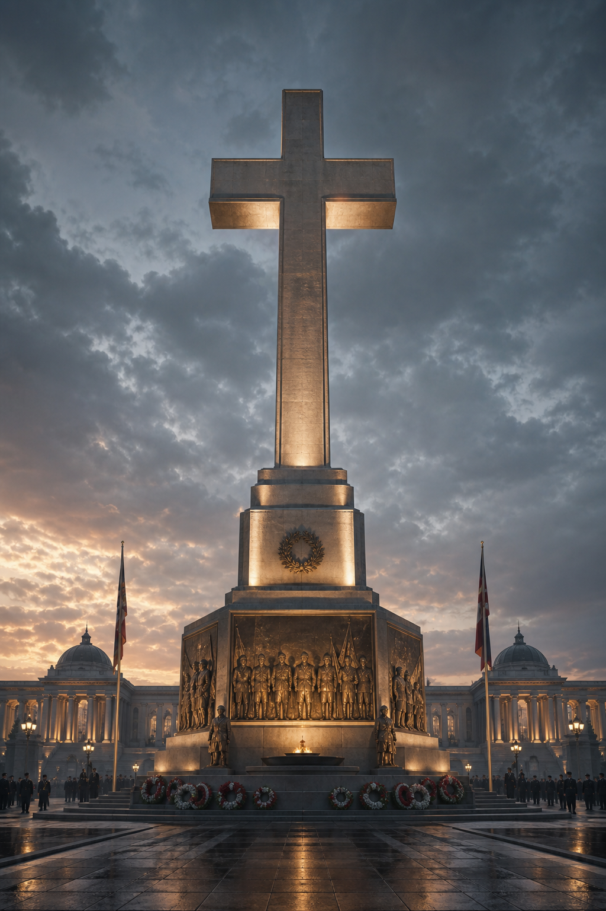

### Monumental Cross

A polished stone cross rises from a civic war memorial, surrounded by wreaths, soldier reliefs, flags, and ceremonial light.
:::

::: {.g-col-12 .g-col-md-6}
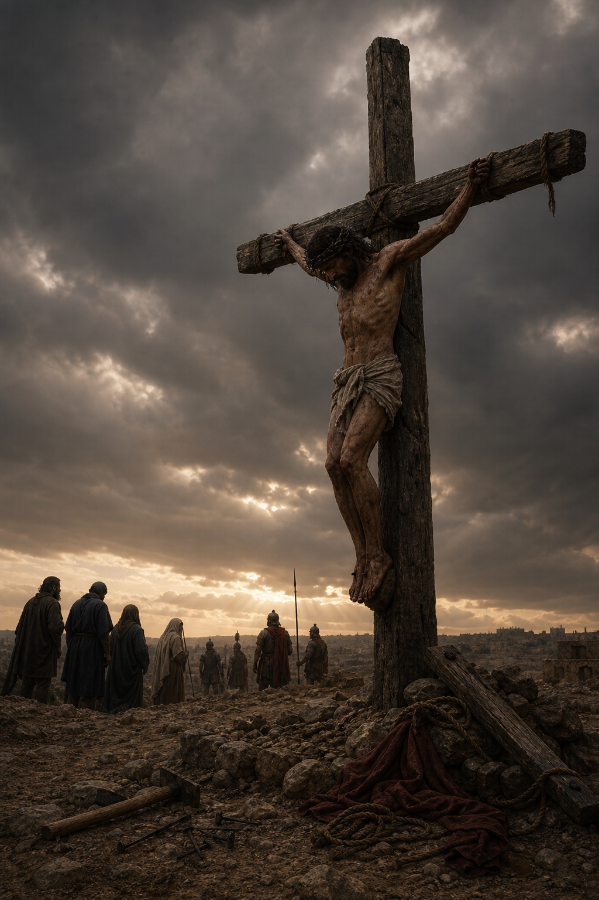

### Crucified Cross

A rough wooden cross stands on Golgotha under storm-darkened skies, with Christ exposed before grieving witnesses and distant soldiers.
:::

::: {.g-col-12 .g-col-md-6}
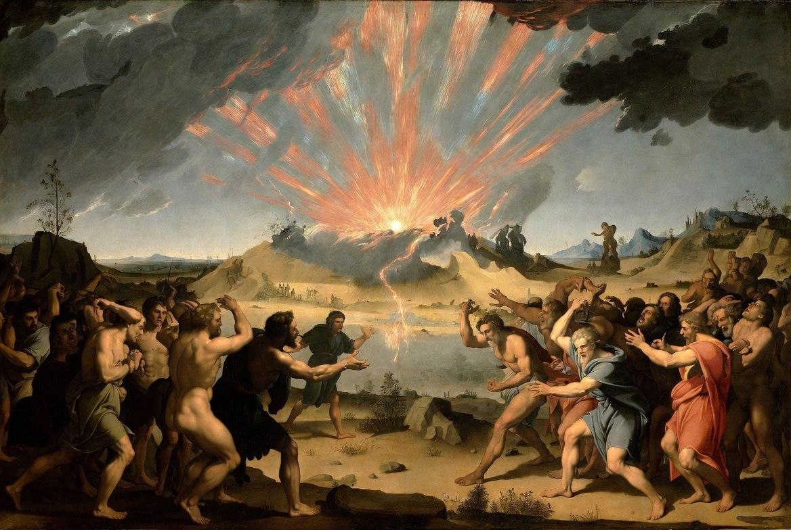

### The Light Breaking Between the Crowds

A classical painted scene of radiant light and lightning bursting over a valley and river, with two crowds on opposite banks recoiling and gesturing toward the light.
:::
:::
