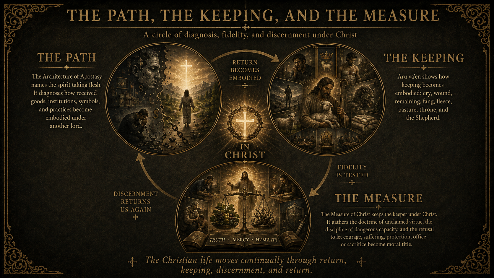

::: {.aoa-hero}
{.aoa-hero-logo fig-alt="The Architecture of Apostasy brand image"}

## A path to be kept. A keeping under Christ. A measure not our own.

Our Christian witness does not ask "What is the correct form?" Instead, we ask how spirit takes flesh, how entrusted good becomes possessed, how faithful forms become apostate bodies, and how keepers remain under Christ rather than becoming the measure themselves.

Within this witness, apostasy is not merely the abandonment of doctrine. It is the condition The Path diagnoses, The Keeping resists, and The Measure returns to Christ.
:::

::: {.troth-litany}

What Is The Troth?

**The Troth remains.**

When strength fails?
**The Troth remains.**

When courage fails?
**The Troth remains.**

When wisdom fails?
**The Troth remains.**

When virtue fails?
**The Troth remains.**

When faithfulness fails?
**The Troth remains.**

When the community fails?
**The Troth remains.**

When institutions fail?
**The Troth remains.**

When rulers fail?
**The Troth remains.**

When the body fails?
**The Troth remains.**

And when I fail the Troth?
**The Troth remains.**

How can the Troth remain when I do not?
Because the Troth does not depend upon my keeping it.
**I am kept by the Troth.**

Where is this revealed?
**In Christ.**

When Peter denies?
**The Troth remains.**

When Judas betrays?
**The Troth remains.**

When the disciples flee?
**The Troth remains.**

When the authorities condemn?
**The Troth remains.**

When the crowd mocks?
**The Troth remains.**

When the body is broken?
**The Troth remains.**

When the tomb is sealed?
**The Troth remains.**

What does the Resurrection proclaim?
**The Troth never failed.**

What, then, do we confess when all else has failed?

The Troth remains.

:::

## Diagnosis, Fidelity, And Discernment

::: {.grid}
::: {.g-col-12 .g-col-md-4}
### The Path

[The Architecture of Apostasy](markdown/the-architecture-of-apostasy.md) names the spirit taking flesh. It diagnoses how received gifts, institutions, symbols, and practices become embodied under another lord.
:::

::: {.g-col-12 .g-col-md-4}
### The Keeping

[Aru va`en](markdown/aru-vaen-a-keeping-of-the-troth.md) shows how keeping becomes embodied: cry, wound, remaining, fang, fleece, pasture, throne, and the Shepherd.
:::

::: {.g-col-12 .g-col-md-4}
### The Measure

[The Measure of Christ](measure.qmd) keeps the keeper under Christ. It refuses to let courage, suffering, protection, office, or sacrifice become moral title.
:::
:::

::: {.pillar-map}
{.path-image .no-lightbox fig-alt="A dark gold and black diagram titled The Path, The Keeping, and The Measure, showing a circular movement of diagnosis, fidelity, and discernment under Christ."}
:::

## First Readings

1. [The Architecture of Apostasy](markdown/the-architecture-of-apostasy.md)
2. [Aru va`en: A Keeping of the Troth](markdown/aru-vaen-a-keeping-of-the-troth.md)
3. [The Troth Remains: An Essay on John 10](markdown/the-troth-remains-john-10.md)
4. [The Measure of Christ](measure.qmd)
5. [Foundations](foundations.qmd)

## Entry Points

::: {.grid}
::: {.g-col-12 .g-col-md-6}
### Foundations

Begin with The Path of Re-Embodiment, The Keeping of the Troth, and The Measure of Christ: the three movements that order the public library.

[Read the foundations](foundations.qmd)
:::

::: {.g-col-12 .g-col-md-6}
### Core Concepts

Discern the vocabulary of spirit, flesh, false logos, apostasy, suffering, repentance, and redemption.

[Review core concepts](core-concepts.qmd)
:::

::: {.g-col-12 .g-col-md-6}
### The Path

Walk the path from false logos through suffering, repentance, death to the false self, and re-embodiment in Christ.

[Walk the path](path.qmd)
:::

::: {.g-col-12 .g-col-md-6}
### The Keeping

Read the Troth as the embodied guard rail: faithfulness under the Shepherd when throne, pasture, fang, and fleece all fail.

[Read the Keeping page](keeping.qmd)
:::

::: {.g-col-12 .g-col-md-6}
### The Measure

Keep judgment, strength, office, and protection answerable to Christ through the doctrine of unclaimed virtue.

[Read The Measure of Christ](measure.qmd)
:::

::: {.g-col-12 .g-col-md-6}
### Reading Paths

Follow curated routes through the library, beginning with diagnosis and moving toward return.

[Choose a reading path](reading-paths.qmd)
:::

::: {.g-col-12 .g-col-md-6}
### Essays

Read the theological essays as witnesses along the way, not as material for detached mastery.

[Browse essays](essays.qmd)
:::

::: {.g-col-12 .g-col-md-6}
### Images

See the symbolic and devotional images that expose false embodiment and gesture toward Christic restoration.

[Open the gallery](images.qmd)
:::

:::
