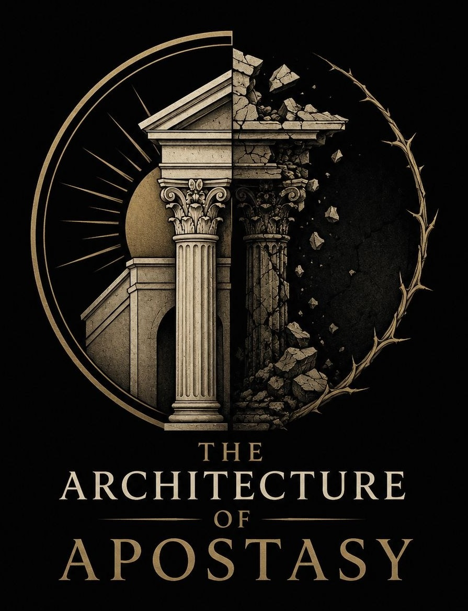

::: {.aoa-hero}
{.aoa-hero-logo fig-alt="The Architecture of Apostasy logo"}

## The Architecture of Apostasy is not a theory to be mastered. It is a path to be walked.

Every human life gives flesh to a spirit. Every habit embodies a logos. Every institution incarnates a way of being. No one stands outside this architecture. We are all becoming the embodiment of something.

The question is not whether we believe correctly in abstraction. The question is whether our spirit and flesh are being conformed to Christ or to a false logos.

**Apostasy is not merely the abandonment of doctrine. It is the embodiment of another lord.**
:::

## The Path

Apostasy becomes visible when a false spirit takes flesh: in the self, the church, the institution, the nation, the crowd, the ideology, the ritual, and the sacrifice.

The way back is not detached observation. It is repentance, suffering, death to the false self, and re-embodiment in Christ.

::: {.path-line}
False logos -> false desire -> repeated bodily practice -> spiritual deformation -> institutional embodiment -> sacrifice -> suffering -> repentance -> death to the false self -> re-embodiment in Christ
:::

[Walk the path of re-embodiment](path-of-re-embodiment.qmd)

## Entry Points

::: {.grid}
::: {.g-col-12 .g-col-md-6}
### Core Concepts

Discern the vocabulary of spirit, flesh, false logos, apostasy, suffering, repentance, and redemption.

[Review core concepts](core-concepts.qmd)
:::

::: {.g-col-12 .g-col-md-6}
### The Church

Face the church as an embodied institution that is loved by Christ, fallen in history, and called to repentance.

[Read the church page](church.qmd)
:::

::: {.g-col-12 .g-col-md-6}
### Reading Paths

Follow curated routes through the archive, beginning with diagnosis and moving toward return.

[Choose a reading path](reading-paths.qmd)
:::

::: {.g-col-12 .g-col-md-6}
### Essays

Read the theological essays as witnesses along the way, not as material for detached mastery.

[Browse essays](essays.qmd)
:::

::: {.g-col-12 .g-col-md-6}
### Images

See the symbolic and devotional images that expose false embodiment and gesture toward Christic restoration.

[Open the gallery](images.qmd)
:::

::: {.g-col-12 .g-col-md-6}
### Archive

Find every public reading copy, image catalog, and source collection.

[Open the full archive](archive.qmd)
:::
:::

## First Readings

- Begin with [The Architecture of Apostasy](markdown/the-architecture-of-apostasy.md) for the title essay.
- Continue with [State-Dressed Religion](markdown/state-dressed-religion.md) for apostasy by incorporation.
- Read [The Pastor Inside the Apostate Architecture](markdown/the-pastor-inside-the-apostate-architecture.md) for the pastoral call inside compromised institutions.
- Use [The Path of Re-Embodiment](path-of-re-embodiment.qmd) to keep the archive ordered toward return.
