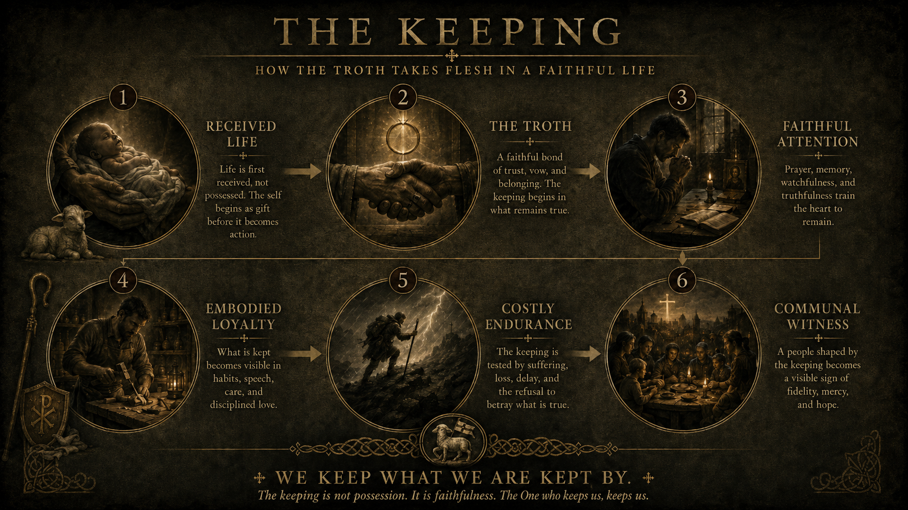

The Keeping of the Troth is the embodied guard rail within The Architecture of Apostasy. It asks whether diagnosis has become mercy, whether the cry is still being heard, and whether faithful response is taking flesh under the Shepherd.

It asks how the Troth takes flesh in a faithful life: received life, trust, attention, loyalty, endurance, and communal witness.

The Keeping is held together with [The Path of Re-Embodiment](path.qmd) and [The Measure of Christ](measure.qmd). The Path asks what spirit has taken flesh; The Measure asks whether the keeper remains under Christ rather than becoming the measure.

It does not replace Scripture, the Church, doctrine, or the received Christian traditions. It gives mythic, devotional, and liturgical language for the question this witness keeps asking: what spirit is taking flesh here, and what would return to Christ require in the body?

## The Keeping

::: {.troth-poster}
{.troth-poster-bg fig-alt="A dark gold and black poster titled The Keeping, showing six stages: received life, the Troth, faithful attention, embodied loyalty, costly endurance, and communal witness."}
:::

## The Keeper

A keeper is one who has been entrusted with something that does not become theirs: a person, office, memory, boundary, household, craft, community, institution, threshold, or work of protection.

The keeper is not the Shepherd. Christ alone is the Shepherd in the final sense. The keeper's authority is derivative, accountable, and temporary. It must remain capable of correction, repentance, and release.

The wolf language in these texts is not a title of superiority. It names dangerous capacity under judgment: strength, vigilance, discernment, command, force, endurance, or boundary-keeping that can protect life or devour it.

The fang is entrusted. It is not a crown.

Faithful keeping must remain answerable to [The Measure of Christ](measure.qmd), where [The Doctrine of Unclaimed Virtue](markdown/the-doctrine-of-unclaimed-virtue.md) keeps courage, suffering, protection, and office from becoming moral title.

## Who This Is For

The Architecture of Apostasy is for readers who sense that Christian discernment cannot stop at correct statements. It is for those asking how belief, habit, institution, technology, economy, and worship become embodied under Christ or under another lord.

The myths gathered under The Keeping of the Troth are for readers who need faithful imagination trained as well as argument. They are for the wounded, the tempted guardian, the one who hears a cry and does not yet know how to answer, and the reader who needs symbols that bend back toward mercy instead of mastery.

They are especially for people and communities carrying responsibility, strength, judgment, office, memory, or protective capacity, not because such capacity makes them superior, but because it makes their temptations more dangerous.

## Read First

1. [Aru va`en: A Keeping of the Troth](markdown/aru-vaen-a-keeping-of-the-troth.md)
2. [The Troth Remains: An Essay on John 10](markdown/the-troth-remains-john-10.md)
3. [The Doctrine of Unclaimed Virtue](markdown/the-doctrine-of-unclaimed-virtue.md)
4. [Aru va`en Reader's Guide](markdown/aru-vaen-readers-guide.md)
5. [Aru va`en: Symbolic Mythology of the Keeping](markdown/aru-vaen-symbolic-mythology.md)
6. [Foundations](foundations.qmd)
