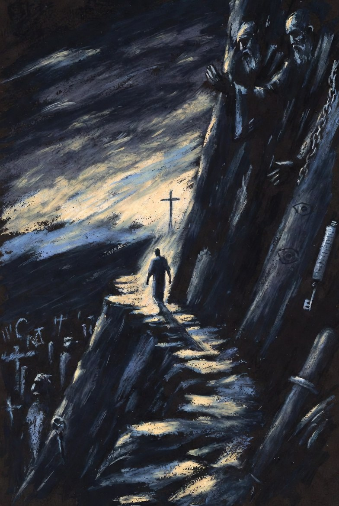

# Legalism, License, And The Elite Mediation of Christ: The Call To Walk The Narrow Path

Source: `raw/Legalism, License, And The Elite Mediation of Christ.pdf`

The Apostle Paul’s cry in **Galatians 3:1** (ESV) rings with holy astonishment: “O foolish Galatians\! Who has bewitched you? It was before your eyes that Jesus Christ was publicly portrayed as crucified.” Paul does not accuse the Galatians of practicing literal sorcery. He expresses bewilderment that they had so quickly abandoned the pure gospel of grace. The Greek verb *baskainō* literally means “to cast an evil spell” or “to injure with the evil eye.” Paul uses it metaphorically: the Galatians were acting in a manner so contrary to their own spiritual interest that it appeared as if a spiritual trance or hypnotic spell had overtaken them.

This “spell” was cast by the **Judaizers**—false teachers who arrived after Paul departed. They insisted that faith in Christ was insufficient for salvation. Gentile believers must also submit to the Mosaic Law through circumcision, strict observance of Jewish dietary laws (keeping kosher), and the keeping of traditional Jewish festivals and Sabbaths. Adding these human requirements, Paul saw, completely hollowed out the finished work of Christ on the cross.

Paul counters their bewitchment with two devastating arguments. First, Christ had been “publicly portrayed as crucified” right before their eyes; to turn to self-effort was to treat His death as useless (**Galatians 3:1**). Second, they had already received the Holy Spirit and witnessed miracles “by hearing with faith,” not by works of the law (**Galatians 3:2–3**; see also **Galatians 3:5**). To attempt to “finish” by the flesh what had begun by the Spirit was absurd. Paul’s burden throughout the letter is a fierce defense of **grace over performance**—faith in Christ’s finished work is entirely sufficient (**Galatians 2:16**; **3:10–14**; **5:2–4**).

### **Two Oppositional Groups and the Authoritarian Coin**

There are two primary oppositional groups: the **Judaizers** (legalism and ceremony) and the **Nicolaitans** (license and compromise). Both, however, operate through an elite clergy class that claims higher knowledge and spiritual authority, positioning itself between the believer and direct access to Jesus. Legalism and license appear opposite, yet they function as two sides of the same authoritarian coin: both mediate and thereby displace Christ as the sole sufficient Lord and Mediator.

The **Judaizers** weaponized the law, demanding external rituals so that right standing with God must be earned or maintained through human performance. The **Nicolaitans**, mentioned explicitly in **Revelation 2**, abused Christian liberty to justify sexual immorality and eating food sacrificed to idols, arguing that physical actions did not affect spiritual purity. Both groups hijacked the direct access purchased when the veil was torn. They forced the laity to rely on human mediation, specialized *gnosis*, or rigid ritualism and shifted focus from Christ’s finished work to human performance—whether ritual checklist or gnostic indulgence.

The name **Nicolaitan** itself is telling. It derives from *nikos* (“to conquer” or “rule”) and *laos* (“the people” or “laity”). Literally, it means “conquerors of the people” or “rulers over the laity.” Early commentators saw this not merely as a personal name but as a description of their operation: the earliest inventors of a rigid clergy/laity divide, a specialized caste claiming exclusive spiritual insights to dictate the lives of ordinary believers. The Judaizers operated similarly as an elite class of religious gatekeepers claiming Jerusalem-sanctioned authority, insisting Paul’s gospel was incomplete and that they alone were the necessary administrators of the true covenant.

### **Paul’s Direct Assault on Religious Elitism**

Paul systematically dismantles every claim of elite pedigree and mediated authority.

* He strips elite Jewish credentials of value: “If anyone else thinks he has reason for confidence in the flesh, I have more: circumcised on the eighth day… a Hebrew of Hebrews; as to the law, a Pharisee… But whatever gain I had, I counted as loss for the sake of Christ. Indeed, I count everything as loss because of the surpassing worth of knowing Christ Jesus my Lord” (**Philippians 3:4–8**; see also **Galatians 1:13–14**).  
* He condemns any human gatekeeper—even an apostle or angel: “I am astonished that you are so quickly deserting him who called you in the grace of Christ and are turning to a different gospel… But even if we or an angel from heaven should preach to you a gospel contrary to the one we preached to you, let him be accursed” (**Galatians 1:6–9**; see also **2 Corinthians 11:13–15**).  
* He declares absolute spiritual equality that destroys every caste system: “For in Christ Jesus you are all sons of God, through faith… There is neither Jew nor Greek, there is neither slave nor free, there is no male and female, for you are all one in Christ Jesus” (**Galatians 3:26–28**; see also **Colossians 3:11**).  
* He proclaims the single, direct Mediator: “For there is one God, and there is one mediator between God and men, the man Christ Jesus” (**1 Timothy 2:5**; see also **Hebrews 8:6**; **9:15**; **12:24**).

### **Jesus’ Condemnation of the Nicolaitans and Hierarchical Usurpation**

In **Revelation 2**, the risen Christ Himself addresses the Nicolaitan error in three of the seven letters.

* To Ephesus: “Yet this you have: you hate the works of the Nicolaitans, which I also hate” (**Revelation 2:6**). Christ hates not only their deeds but the very structural grip they sought.  
* To Pergamum, He links them to Balaam: “You have some there who hold the teaching of Balaam, who taught Balak to put a stumbling block before the sons of Israel, so that they might eat food sacrificed to idols and practice sexual immorality. So also you have some who hold the teaching of the Nicolaitans in the same way” (**Revelation 2:14–15**).  
* To Thyatira, He exposes the “Jezebel” figure and her claim to “deep things”: “But I have this against you, that you tolerate that woman Jezebel, who calls herself a prophetess and is teaching and seducing my servants to practice sexual immorality and to eat food sacrificed to idols… But to the rest of you in Thyatira, who do not hold this teaching, who have not learned what some call the deep things of Satan, to you I say, I do not lay on you any other burden” (**Revelation 2:20, 24**).

**Colossians 2** serves as Paul’s ultimate synthesis, simultaneously refuting elite philosophy, ritual legalism, and licentious mysticism:

“See to it that no one takes you captive by philosophy and empty deceit, according to human tradition, according to the elemental spirits of the world, and not according to Christ” (**Colossians 2:8**).

“Therefore let no one pass judgment on you in questions of food and drink, or with regard to a festival or a new moon or a Sabbath. These are a shadow of the things to come, but the substance belongs to Christ” (**Colossians 2:16–17**).

“Let no one disqualify you, insisting on asceticism and worship of angels, going on in detail about visions, puffed up without reason by his sensuous mind, and not holding fast to the Head, from whom the whole body, nourished and knit together through its joints and ligaments, grows with a growth that is from God” (**Colossians 2:18–19**).

### **The Historical Origins of the Nicolaitans and Christ’s Mandate Against Hierarchy**

Church tradition traces the Nicolaitans in two complementary ways. Some early fathers (Irenaeus, Hippolytus) link them to Nicolas, one of the seven deacons chosen in **Acts 6:5**—a Gentile proselyte to Judaism who then embraced Christ but later fell into error, misinterpreting Christian liberty as permission for physical indulgence without spiritual consequence. His followers formed an elite, gnostic-leaning sect claiming “higher understanding” that allowed participation in pagan Roman culture, temple prostitution, and idolatry. Others view “Nicolaitan” symbolically as “conquerors of the laity”—the inventors of the clergy/laity divide itself, a caste claiming exclusive insights to rule ordinary believers.

This drive to conquer the laity and establish religious elites is precisely what Jesus outlawed in **Matthew 23:8–11** (ESV):

“But you are not to be called rabbi, for you have one teacher, and you are all brothers. And call no man your father on earth, for you have one Father, who is in heaven. Neither be called instructors, for you have one instructor, the Christ. The greatest among you shall be your servant.”

Jesus establishes radical horizontal equality: “You are all brothers.” No believer possesses intrinsic spiritual authority or ownership over another’s conscience. When Judaizers demanded submission to their “fathers” of tradition or Nicolaitans claimed to be the ultimate “teachers” of deep secrets, they usurped titles belonging only to God and Christ.

### **The Universal Priesthood and Kingship of All Believers**

The New Testament’s answer to both errors is the **priesthood of all believers**. Every Christian has been upgraded to the highest spiritual office.

* Direct access: “Therefore, brothers, since we have confidence to enter the holy places by the blood of Jesus, by the new and living way that he opened for us through the curtain, that is, through his flesh… let us draw near with a true heart in full assurance of faith” (**Hebrews 10:19–22**; see also **Hebrews 4:14–16**; **10:19–25**).  
* Royal priesthood: “But you are a chosen race, a royal priesthood, a holy nation, a people for his own possession, that you may proclaim the excellencies of him who called you out of darkness into his marvelous light” (**1 Peter 2:9**; foreshadowed in **Exodus 19:5–6**).  
* Kings and priests by blood: “To him who loves us and has freed us from our sins by his blood and made us a kingdom, priests to his God and Father, to him be glory and dominion forever and ever. Amen” (**Revelation 1:5–6**; see also **Revelation 5:9–10**).

| Error Group | Operational Method | Scriptural Counter-Truth |
| ----- | ----- | ----- |
| **Judaizers** (Legalism) | Force reliance on elite administrators of ceremonies, days, and laws | Christ alone is Mediator; the veil is torn; we are all equal sons through faith (**Galatians 3:26–28**; **1 Timothy 2:5**; **Colossians 2:16–17**) |
| **Nicolaitans** (License) | “Conquer the laity” by claiming elite, deeper knowledge permitting compromise and hierarchy | Universal priesthood and kingship; every believer is already a king and priest with direct access (**1 Peter 2:9**; **Revelation 1:5–6**; **Hebrews 10:19–22**) |

### **The Ancient Roots: Pharisees, Sadducees, and the Recurring Leaven**

These two groups are the direct ideological heirs of the Pharisees and Sadducees. Jesus warned: “Take heed and beware of the leaven of the Pharisees and of the Sadducees” (**Matthew 16:6** KJV; see also **Matthew 16:11–12**). Leaven alters the entire batch from within. The Pharisees specialized in rigid external metrics, “the tradition of the elders,” and thousands of micro-rules that built a fence around the Law, turning themselves into elite gatekeepers (**Matthew 15:1–9**; **Mark 7:1–13**). The Judaizers simply baptized Pharisaism—accepting Jesus as Messiah yet insisting salvation still required Pharisaic mastery of external law.

The Sadducees were wealthy, politically connected aristocratic elites who denied the resurrection, angels, and afterlife. Comfortably anchored in the present world, they compromised with pagan Rome to preserve status and power. The Nicolaitans applied this same secular mindset inside the church, claiming specialized *gnosis* that permitted compromise with Roman culture, idol food, and immorality.

Satan’s polemic against *The Way* has always used this binary trap. Throughout church history the institutional church has frequently operated in competition with Christ to “bewitch” believers—mutating the *ekklesia* (the called-out assembly) from a living body directly connected to its Head into a human-driven corporation or control hierarchy. The legalistic trap (“You are not clean enough”) enslaves believers to human systems and performance tracking. The licentious trap (“You are not enlightened enough”) dissolves holiness until the church becomes indistinguishable from the world. Both create a mediated, multi-tiered caste system that strips ordinary believers of their royal priesthood.

### **Jude’s Warning and the Straight and Narrow Path**

Jude, intending to write a letter of comfort about salvation, was compelled instead to sound an emergency alarm: “I found it necessary to write appealing to you to contend for the faith that was once for all delivered to the saints. For certain people have crept in unnoticed… ungodly people, who pervert the grace of our God into sensuality and deny our only Master and Lord, Jesus Christ” (**Jude 1:3–4**; see also **2 Peter 2:1–3**; **Acts 20:29–30**; **Galatians 2:4**). These infiltrators built platforms *within* the *ekklesia*, using the language of faith to hijack it. Their weapon was hyper-grace license—the Nicolaitan error.

Jude 1:11 gives three Old Testament prototypes: “Woe to them\! For they walked in the way of Cain and abandoned themselves for the sake of gain to Balaam’s error and perished in Korah’s rebellion.”

* **Way of Cain** — self-styled religion and legalistic merit: bringing the fruit of human labor rather than the required blood sacrifice; elite pride rejecting the cross.  
* **Balaam’s error** — commercialized ministry and license: a prophet for hire who used spiritual office for gain and seduced God’s people into immorality and pagan compromise.  
* **Korah’s rebellion** — demand for an elite priestly caste: revolt against God’s appointed order to assert human authority over the assembly.

The Old Testament source for the guiding voice is **Isaiah 30:20–21** (ESV), spoken when Israel sought worldly alliance with Egypt instead of trusting God directly:

“And though the Lord give you the bread of adversity and the water of affliction, yet your Teacher will not hide himself anymore, but your eyes shall see your Teacher. And your ears shall hear a word behind you, saying, ‘This is the way, walk in it,’ when you turn to the right or when you turn to the left.”

The capital “T” Teacher promises direct guidance, removing confusing intermediate human teachers (linking directly to **Matthew 23**). The voice speaks precisely when one begins to drift right (Pharisaic legalism and rigid human control) or left (Sadducean license, worldliness, and moral compromise). It functions as an internal gyroscope, constantly returning the believer to the center line: Jesus Christ and Him crucified.

Jesus describes this path as “strait” (*stenos*—constricted, pressed, narrow) in **Matthew 7:13–14** (ESV):

“Enter by the narrow gate. For the gate is wide and the way is easy that leads to destruction, and those who enter by it are many. For the gate is narrow and the way is hard that leads to life, and those who find it are few.”

Immediately He warns: “Beware of false prophets, who come to you in sheep’s clothing but inwardly are ravenous wolves” (**Matthew 7:15**; see also **2 Peter 2:18–19**). The path is constricted because it leaves no room for human ego or additions. One cannot bring the heavy baggage of the right cliff (ritual credentials, legalistic checklists, pride of performance, elite religious pedigree) nor the loose baggage of the left cliff (worldly compromises, carnal indulgences, rewritten moral codes, hyper-grace excuses to sin). The center line is faith alone working through love, direct unmediated union with Christ.

### **Tuning the Ear to the Shepherd’s Voice Amidst Modern Institutional Noise**

Tuning one’s ear to the direct, guiding Voice of the True Teacher requires deliberate spiritual de-cluttering. The goal of religious elites on both cliffs is to make believers dependent on their mediation; the believer’s goal must be unmediated intimacy with Jesus Christ.

1. **Master the Tone of the True Teacher (The Audit Test)** “When he has brought out all his own, he goes before them, and the sheep follow him, for they know his voice. A stranger they will not follow, but they will flee from him, for they do not know the voice of strangers” (**John 10:4–5**; see also **John 10:27**; **Psalm 23**). Perform a regular “voice audit” on spiritual content consumed. The filter: Does it leave you looking at *yourself* (performance, sin, enlightenment, political alignment, institutional validation) or entirely at *Jesus*? If the primary output is anxiety, rigid control, or cultural compromise, it is the voice of a stranger—flee from it (**2 Timothy 4:3–4**).  
2. **Return to the “Once for All Delivered” Text** “Contend for the faith that was once for all delivered to the saints” (**Jude 1:3**). The core gospel is closed, complete, and fully accessible; it requires no modern updates or elite institutional interpretations. Prioritize raw Scripture over the commentary industry, podcasts, and endless sub-cultures. For every hour spent consuming *content about* God, spend equal or greater time reading the Bible directly, letting the Holy Spirit be the primary Exegete (**John 14:26**; **16:13**; **1 Corinthians 2:10–13**).  
3. **Cultivate “The Secret Place” (The Death of the Stage)** “But when you pray, go into your room and shut the door and pray to your Father who is in secret. And your Father who sees in secret will reward you” (**Matthew 6:6**; see also **Matthew 6:5–18**). Religious hierarchies thrive on spectacles and corporate metrics. Build a hidden spiritual life that no one else sees, measures, or profits from. If faith functions only amid mega-church lights, strict accountability systems, or online validation, it is anchored in an institution, not Christ.  
4. **Recognize the Promptings of the Internal Gyroscope** The promise of **Isaiah 30:21** is fulfilled in the indwelling Holy Spirit: “I write these things to you about those who are trying to deceive you. But the anointing that you received from him abides in you, and you have no need that anyone should teach you. But as his anointing teaches you about everything, and is true, and is no lie—just as it has taught you, abide in him” (**1 John 2:26–27**; see also **John 14:26**; **1 Corinthians 2:15**). Learn the specific “friction” of the Spirit. Drift toward legalism (right): conviction of pride, self-righteousness, lack of love. Drift toward license (left): conviction of worldliness, compromise, grieving God’s holiness. These internal checks *are* the voice saying, “This is the way, walk in it.”  
5. **Shift from Institutional “Membership” to Ekklesia “Fellowship”** The New Testament knows nothing of solitary Christianity, yet sharply distinguishes *Institution* (hierarchies protecting structure) from *Ekklesia* (relationships manifesting Christ). Seek horizontal, low-overhead gatherings where **1 Corinthians 14:26** actually occurs: “When you come together, each one has a hymn, a lesson, a revelation…” Look for spaces where the universal priesthood is practiced, every believer functions, and Jesus—not a charismatic leader or rigid board—is the undisputed Head (**Ephesians 4:15–16**; **Colossians 2:19**).

### **Stand Fast in the Liberty**

The institutional church has too often positioned itself *as the gate* rather than a signpost to the narrow path. When it demands legalistic submission to its rules or offers an enlightened, compromised grace that tolerates the world’s desires, it operates in the spirit of the wolves Jesus warned against. The true *ekklesia* stays on the path by ignoring the competing shouts of the modern Pharisees and Sadducees on either cliff and listening instead to the specific, quiet Voice of the True Teacher behind saying: **“This is the way. Walk in it.”**

Paul’s summary remains the battle cry for every generation: “Stand fast therefore in the liberty wherewith Christ hath made us free, and be not entangled again with the yoke of bondage” (**Galatians 5:1** KJV; see also **Galatians 5:13**; **2 Corinthians 3:17**).

The narrow ridge is flanked by two steep cliffs. The baggage of merit on the right and the baggage of carnality on the left both weigh the traveler down and pull him off the path. Stripped of self, looking only to Christ, the believer walks in the liberty and direct access purchased by His blood—royal priest and king, son of God, with the anointing that teaches and the Voice that guides. The noise fades. The path clears. The single Voice becomes beautifully loud and distinct.

Soli Deo Gloria.
