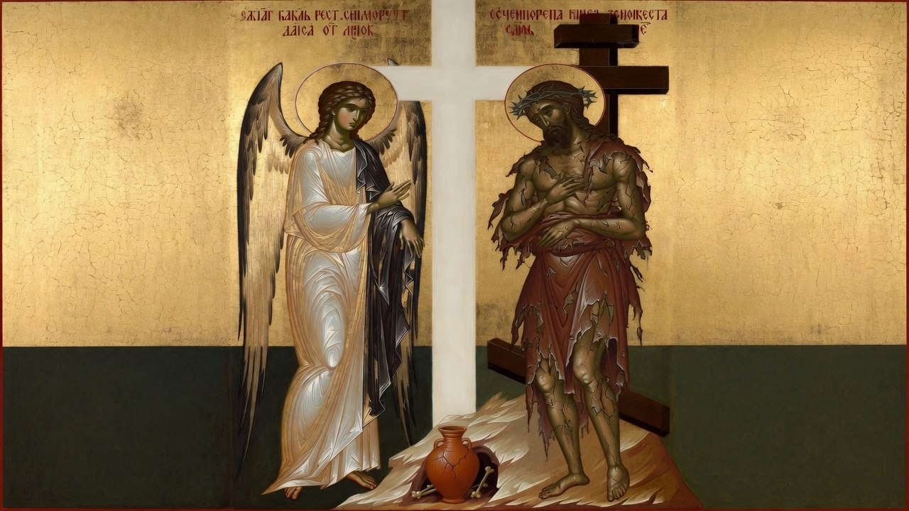

# The Angel of Light and the Suffering Servant: Satan’s Aesthetic Deceptions and God’s Revelation of Glory Through Weakness, Affliction, and the Cross

Source: `raw/The Angel of Light and the Suffering Servant.pdf`

The human eye is a poor judge of spiritual reality. From the first pages of Scripture to the final visions of Revelation, the Bible presents a sustained and often shocking inversion: what appears beautiful, impressive, comfortable, or spiritually successful to fallen sensibilities is frequently the very instrument of deception, while what appears weak, ordinary, afflicted, or even repulsive often carries the genuine power and presence of God. This is not a minor theme. It lies at the heart of the conflict between the kingdom of darkness and the kingdom of Christ.

The observation is ancient yet urgently contemporary. Churches and ministries can present themselves with architectural grandeur, polished production, large followings, and the language of blessing and victory, yet be filled with doctrinal compromise, worldly compromise, and a form of godliness that denies the power of the cross. Meanwhile, the most faithful remnants are sometimes found among the poor, the socially marginal, the physically unremarkable, or those marked by visible suffering and lowliness. Scripture does not treat this pattern as accidental. It presents it as the predictable outworking of two opposing strategies: one that weaponizes human aesthetic and sensual preferences, and another that deliberately offends and crucifies those preferences in order to reveal a glory that cannot be counterfeited.

### **The Origin of the Aesthetic Trap**

The strategy of deception begins in Eden. When the serpent approached the woman, he did not present an obviously repulsive option. Instead, he directed her attention to three dimensions that would later be summarized by the apostle John:

“For all that is in the world—the desires of the flesh and the desires of the eyes and pride of life—is not from the Father but is from the world.” (1 John 2:16)

Genesis records the moment of decision with chilling precision:

“So when the woman saw that the tree was good for food, and that it was a delight to the eyes, and that the tree was to be desired to make one wise, she took of its fruit and ate…” (Genesis 3:6)

Physical satisfaction, visual allure, and the promise of elevated wisdom—the tripartite trap—was enough to override direct divine command. The enemy discovered early that the fallen human sensorium could be turned against the soul. What looked good, felt promising, and flattered the desire for significance became the gateway to death.

This same pattern recurs throughout redemptive history. Satan does not primarily appear as a monster. He appears as an angel of light. The apostle Paul warns the Corinthians:

“And no wonder, for even Satan disguises himself as an angel of light. Therefore it is no surprise if his servants, also, disguise themselves as servants of righteousness. Their end will correspond to their deeds.” (2 Corinthians 11:14–15)

The deception is not crude. It is sophisticated. False apostles and false teachers come “in sheep’s clothing, but inwardly are ravenous wolves” (Matthew 7:15). They speak “smooth things” and “prophesy illusions” (Isaiah 30:10). They accumulate teachers who suit the passions of itching ears rather than sound doctrine (2 Timothy 4:3). The appeal is rarely to overt evil; it is to comfort, spectacle, prestige, and a version of spirituality that requires no death to self.

### **Whitewashed Tombs and Prosperous Corpses**

Jesus’ most searing indictment of religious aesthetics falls upon the scribes and Pharisees:

“Woe to you, scribes and Pharisees, hypocrites\! For you are like whitewashed tombs, which outwardly appear beautiful, but within are full of dead people’s bones and all uncleanness. So you also outwardly appear righteous to others, but within you are full of hypocrisy and lawlessness.” (Matthew 23:27–28)

Outward beauty and social respectability become a cover for inward corruption. The same principle receives its most devastating application in the letter to the church in Laodicea. This congregation measured its spiritual condition by the very metrics the world uses for success:

“You say, ‘I am rich, I have prospered, and I need nothing,’ not realizing that you are wretched, pitiable, poor, blind, and naked.” (Revelation 3:17)

Laodicea was not a persecuted, struggling church. It was prosperous, self-sufficient, and apparently impressive. Christ’s diagnosis was the precise opposite of its self-assessment. The remedy He prescribed was equally telling: gold refined by fire, white garments to cover nakedness, and salve for blind eyes. In other words, the very things the church thought it already possessed in abundance—wealth, righteousness, and spiritual sight—had to be obtained through the painful processes it had avoided. The prosperous exterior had masked a catastrophic interior poverty.

The Old Testament prophets repeatedly confronted the same illusion. Israel trusted in the architectural glory of the temple while practicing oppression and idolatry inside it (Jeremiah 7:4). God declared through Amos that He despised their solemn assemblies and would not listen to the melody of their harps when justice was absent (Amos 5:21–23). Beautiful worship that covered a lack of righteousness became noise in His ears.

### **God’s Deliberate Inversion: Choosing What the Flesh Despises**

In direct contrast, God’s method of revelation and salvation consistently bypasses and offends human aesthetic criteria. The clearest exposition appears in Paul’s first letter to the Corinthians:

“For the word of the cross is folly to those who are perishing, but to us who are being saved it is the power of God. For it is written, ‘I will destroy the wisdom of the wise, and the discernment of the discerning I will thwart.’ … For consider your calling, brothers: not many of you were wise according to worldly standards, not many were powerful, not many were of noble birth. But God chose what is foolish in the world to shame the wise; God chose what is weak in the world to shame the strong; God chose what is low and despised in the world, even things that are not, to bring to nothing things that are, so that no human being might boast in the presence of God.” (1 Corinthians 1:18–29)

The message itself—the crucified Messiah—was a stumbling block to Jews expecting signs of power and folly to Greeks expecting philosophical sophistication. God did not merely tolerate this offense; He designed the method so that human boasting would be impossible. The same principle governed the composition of the early church and the character of its leaders.

Paul reinforces the point with the metaphor of the jar of clay:

“But we have this treasure in jars of clay, to show that the surpassing power belongs to God and not to us.” (2 Corinthians 4:7)

In the ancient world, a clay jar was the cheapest, most common, most fragile, and least adorned vessel available. If treasure were placed in a golden box, observers would praise the box. Placed in a cracked clay pot, attention is forced upon the value of what the vessel contains. God keeps His people outwardly ordinary, weak, and unremarkable precisely so that when supernatural power moves through them, the glory cannot be attributed to human excellence.

This pattern is not limited to the New Testament. Throughout the Old Testament, God repeatedly chose and used the unlikely, the weak, and even the outwardly offensive. Gideon was from the weakest clan in Manasseh and the least in his father’s house; he was hiding from the Midianites when called. God deliberately reduced his army from tens of thousands to three hundred so that Israel could not boast that its own strength had delivered it (Judges 7:2). David was the overlooked youngest son, a shepherd rather than a warrior of impressive stature. Moses protested his own lack of eloquence. The prophets often embodied their messages in ways that violated contemporary sensibilities: Elijah in a garment of hair and leather belt, John the Baptist in camel’s hair eating locusts and wild honey, Isaiah walking naked for three years as a sign, Ezekiel performing extended prophetic actions that included the use of dung, and Hosea commanded to marry a prostitute as a living parable of God’s relationship with Israel. These were not aesthetically pleasing or socially prestigious methods. They were chosen precisely because they offended the flesh and could not be explained by human wisdom or charm.

The apostles continued the pattern. Paul catalogs the actual conditions of his ministry:

“To the present hour we hunger and thirst, we are poorly dressed and buffeted and homeless… We have become, and are still, like the scum of the world, the refuse of all things.” (1 Corinthians 4:11–13)

Later he lists beatings, imprisonments, shipwrecks, hunger, thirst, cold, and exposure (2 Corinthians 11:23–28). If measured by the aesthetic and prosperity standards of much contemporary religious culture, these men would be diagnosed as outside the blessing of God. Yet they carried the fire of the living God.

### **The Crucible of Affliction and the Death of the Flesh**

God does not merely tolerate weakness and affliction; He actively uses them as the primary instruments of sanctification and revelation. The outer self must waste away so that the inner self can be renewed:

“So we do not lose heart. Though our outer self is wasting away, our inner self is being renewed day by day. For this light momentary affliction is preparing for us an eternal weight of glory beyond all comparison, as we look not to the things that are seen but to the things that are unseen. For the things that are seen are transient, but the things that are unseen are eternal.” (2 Corinthians 4:16–18)

The same principle appears throughout the apostolic writings. Trials test and refine faith like gold in a furnace (1 Peter 1:6–7; James 1:2–4). The Lord disciplines those He loves, and while the discipline is painful, it later yields the peaceful fruit of righteousness (Hebrews 12:5–11). Isaiah records God’s own description of His refining work:

“Behold, I have refined you, but not as silver; I have tried you in the furnace of affliction.” (Isaiah 48:10)

The purpose is not merely endurance but transformation. The flesh—with its preference for comfort, appearance, and self-exaltation—must be put to death so that the life of Christ may be manifested. This is why the cross stands at the center of Christian revelation. It was the most aesthetically and socially repulsive form of execution in the ancient world: public nakedness, shame, association with criminals, and apparent defeat. Yet it was precisely there that God displayed His power and love. Christ “emptied himself, by taking the form of a servant… he humbled himself by becoming obedient to the point of death, even death on a cross” (Philippians 2:7–8). The offense of the cross remains the test of whether a message is truly of God or has been accommodated to the sensibilities of the flesh (Galatians 5:11).

True spiritual beauty, according to Scripture, is therefore inward and often invisible to the natural eye:

“Do not let your adorning be external—the braiding of hair and the putting on of gold jewelry, or the clothing you wear—but let your adorning be the hidden person of the heart with the imperishable beauty of a gentle and quiet spirit, which in God’s sight is very precious.” (1 Peter 3:3–4)

The king’s daughter is “all glorious within” (Psalm 45:13). What the world calls ugly or pitiable—brokenness, humility, suffering for righteousness, lowliness of estate—often becomes the very soil in which the life of God grows.

### **Discerning by Fruit Rather Than Appearance**

Jesus provided the practical test for distinguishing the true from the counterfeit:

“You will recognize them by their fruits. Are grapes gathered from thornbushes, or figs from thistles? So, every healthy tree bears good fruit, but the diseased tree bears bad fruit.” (Matthew 7:16–17)

Outward appeal, numerical success, aesthetic excellence, or claims of blessing are not reliable indicators. The fruit of the Spirit—love, joy, peace, patience, kindness, goodness, faithfulness, gentleness, self-control—grows in soil that has been broken and fertilized by the cross. Where these qualities are absent or replaced by the works of the flesh, no amount of external splendor can validate the ministry or movement.

The Beatitudes and their corresponding woes further invert worldly evaluation. The poor in spirit, those who mourn, the meek, those who hunger and thirst for righteousness, the merciful, the pure in heart, the peacemakers, and the persecuted are pronounced blessed. Conversely, woe is pronounced upon the rich, the full, those who laugh now, and those of whom all speak well (Luke 6:20–26). These are not merely ethical instructions; they are descriptions of the kingdom’s value system, which systematically contradicts the aesthetic and status preferences of fallen humanity.

### **The Necessity of Reoriented Perception**

The warfare of appearances will continue until the end. The enemy will always offer a version of spirituality that flatters the eyes, soothes the flesh, and confers social or religious prestige while avoiding the offense of the cross. God will continue to hide His most precious treasures in jars of clay and to refine His people in furnaces of affliction. The question for every generation is whether it will judge by what the eyes see or by the testimony of the Spirit and the fruit that remains when all outward supports are stripped away.

The man of sorrows had no form or majesty that we should look at Him, and no beauty that we should desire Him (Isaiah 53:2). The angel of light offers splendor that conceals corruption. Between these two figures lies the entire drama of redemption. Those who learn to look past the whitewashed tomb and the prosperous corpse, who recognize the jar of clay as the chosen vessel, and who embrace the cross as the wisdom and power of God rather than its shame, discover a glory that the eye has not seen and that cannot be counterfeited by any aesthetic appeal.

In the end, the test is not whether something looks successful, feels comforting, or commands respect in the eyes of the world or the religious establishment. The test is whether it bears the marks of the cross—whether it puts the flesh to death so that the Spirit may live, and whether it produces the imperishable beauty of a heart aligned with the character of Christ. All other glories will fade. Only what has passed through the fire will remain.
