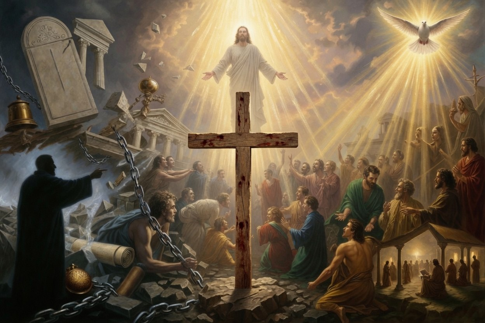

# The Law of Liberty: From the Pure Heart to the Living Christ, the Organic Ekklesia, and the Call Out of Institutional Captivity

Source: `raw/The Law of Liberty In Love.pdf`

"To the pure, all things are pure, but to those who are corrupted and do not believe, nothing is pure. In fact, both their minds and consciences are corrupted." (Titus 1:15)

"'All things are lawful,' but not all things are helpful. 'All things are lawful,' but not all things build up." (1 Corinthians 10:23)

These two apostolic statements stand at the head of a single, unbroken line of biblical revelation. They are not isolated ethical maxims. They are the doorway into the deepest movement of the New Testament: the shift from every form of external written code and ritual performance to an internal, Spirit-produced transformation whose inevitable fruit is both genuine purity and a freedom that is always exercised in self-giving love. The conversation that began with these verses did not remain theoretical. It moved relentlessly through the cross, through the teaching and deliberate actions of Jesus, through the crisis decision of the Jerusalem Council, and finally into the very nature of the assembly Christ promised to build. What follows is that entire trajectory unfolded in full, without abbreviation, without the loss of any link in the chain, and with the historical and structural implications carried all the way to their necessary conclusion in our own day.

### **The Heart Determines Purity; Liberty Is Real but Never License**

Paul wrote Titus 1:15 while Titus labored to set the churches of Crete in order. The island was infested with false teachers from the circumcision party who insisted that Gentile believers must still submit to the full ceremonial apparatus of the Mosaic law—dietary distinctions, ritual washings, and the entire system of clean and unclean. Paul’s answer is breathtaking in its directness: the issue is not the object; the issue is the subject. Ritual impurity has no power to touch the one whose heart has been made pure by faith in Christ. External things cannot defile the heart that has already been cleansed from within.

The converse is equally true and equally devastating. A heart that remains corrupted and unbelieving can perform every ritual with flawless precision and yet produce nothing but further corruption, because the defilement was never located in the physical substance in the first place. This is precisely what Jesus had already declared when He said, “There is nothing outside a person that by going into him can defile him, but the things that come out of a person are what defile him” (Mark 7:15). The entire category of defilement had been relocated from the external rite to the condition of the human heart.

The Corinthian situation supplied the necessary complement. In that city, meat left over from pagan temple sacrifices was sold in the public markets. Some believers, armed with the theological insight that “an idol has no real existence” (1 Corinthians 8:4), felt perfectly free to eat it. Others, whose consciences had been formed under years of Jewish or pagan scrupulosity, were scandalized. Paul does not deny the theological freedom. He quotes the slogan the Corinthians loved to repeat—“All things are lawful for me”—but he immediately refuses to let it stand alone. In both 1 Corinthians 6:12 and 10:23 he adds the same decisive qualification: not all things are helpful; not all things build up. Liberty is real. It is a blood-bought reality. But it is never the final question. The final questions are always these: Does this action strengthen the soul of the one who performs it? Does it strengthen or weaken the brothers and sisters who are watching? Does it cause a weaker conscience to stumble into sin or confusion?

Thus the two verses already contain, in seed form, the entire tension and resolution of New Testament ethics. Radical freedom from external ritual law is joined, inseparably and forever, to radical responsibility toward the people for whom Christ died. Freedom divorced from love becomes destructive license. Love divorced from freedom becomes a new and subtler form of legalism. Only the Spirit of God holds both together without collapse.

### **The Cross Ends the Law of Sin and Death**

This tension receives its decisive resolution at the cross. When the Father made the sinless Son to be sin for us (2 Corinthians 5:21), He did far more than forgive individual acts of transgression. He dismantled the legal mechanism that had held humanity in bondage. The law of sin and death— the written code that could only expose sin, condemn the sinner, and produce death—lost its power over those who are in Christ. “For the law of the Spirit of life has set you free in Christ Jesus from the law of sin and death. For God has done what the law, weakened by the flesh, could not do. By sending his own Son in the likeness of sinful flesh and for sin, he condemned sin in the flesh” (Romans 8:2-3). The record of debt that stood against us with its legal demands was canceled, set aside, and nailed to the cross (Colossians 2:14).

Paul is careful never to say that the Law of Moses was evil or that God had made a mistake in giving it. He says something far more precise. The law was a guardian, a tutor, a schoolmaster given until Christ should come (Galatians 3:24-25). It was a shadow cast by the good things that were to come; it possessed the outline but not the substance (Hebrews 10:1). Its functions were real but temporary and preparatory: to restrain transgression, to make sin visible as transgression, and to point forward to the Seed who would fulfill every promise. Once the reality arrived in the person of Jesus Christ, the shadow and the tutor were no longer needed in the same form.

What replaced the written code was not the absence of law but a deeper, living law—the law of Christ, which is nothing less than love itself. Jesus, when asked for the greatest commandment, compressed the entire Law and the Prophets into two: love the Lord your God with all your heart, soul, and mind, and love your neighbor as yourself. “On these two commandments depend all the Law and the Prophets” (Matthew 22:37-40). Paul repeats the same compression: “The one who loves another has fulfilled the law… Love is the fulfilling of the law” (Romans 13:8, 10). And again: “Bear one another’s burdens, and so fulfill the law of Christ” (Galatians 6:2).

This is why the new covenant is described, not as the writing of a better list on better stone, but as God writing His law directly upon the human heart (Jeremiah 31:33; Hebrews 8:10). The letter kills because it remains external to the person who reads it or performs it. The Spirit gives life because He enters the person, changes the desires, and produces from within what no external command could ever produce. A written checklist can be obeyed while the heart remains untouched or even hostile. The indwelling Spirit changes the heart itself so that what was once a list of prohibitions becomes the spontaneous outflow of a new nature.

### **Written Codes and Rituals Are Structurally Vulnerable to Inversion**

At this point the conversation reached its most penetrating diagnostic insight. Any system whose primary reliance is upon external written rules or ritual performances carries within itself an inescapable vulnerability. Human hearts that remain untransformed are remarkably clever at keeping the letter while completely inverting the intent.

God had diagnosed this problem long before Christ appeared. Through Isaiah He said, “These people draw near with their mouth and honor me with their lips, while their hearts are far from me, and their fear of me is a commandment taught by men” (Isaiah 29:13). The Pharisees of Jesus’ generation had turned this diagnosis into a fine art. They could count out the tiniest herbs in their gardens to ensure they tithed even the smallest increase, yet they “neglected the weightier matters of the law: justice and mercy and faithfulness” (Matthew 23:23). They could strain out a gnat from their soup while swallowing an entire camel of injustice, because their metric of righteousness was entirely external, countable, and therefore gameable by any sufficiently intelligent but unregenerate mind.

Jesus refused to let the matter remain theoretical. He used the most organic imagery possible: “Every healthy tree bears good fruit, but the diseased tree bears bad fruit. A healthy tree cannot bear bad fruit, nor can a diseased tree bear good fruit” (Matthew 7:17-18). And again: “The good person out of the good treasure of his heart produces good, and the evil person out of his evil treasure produces evil, for out of the abundance of the heart his mouth speaks” (Luke 6:45). The point is not that behavior is unimportant. The point is that behavior is the fruit, not the root. No amount of external regulation can make a diseased tree produce good fruit. No amount of external deregulation can make a healthy tree produce bad fruit. The source must be changed.

Rituals, therefore, are never the destination. They are signposts whose only enduring value lies in the degree to which they lead a person into genuine dependence upon God and genuine transformation of the heart. When they cease to perform that function, they become idols that give the appearance of piety while masking and even protecting internal corruption.

### **Christ Himself Becomes the Standard That Admits No Loopholes**

Because every written code is vulnerable to this kind of manipulation, God did not respond by issuing a longer or more detailed list. He gave a living Person and said, in effect, “Become like Him.” The command “You therefore must be perfect, as your heavenly Father is perfect” (Matthew 5:48) stands at the climax of the Sermon on the Mount. It is not a new legal burden dropped from heaven. It is the final demolition of every loophole the human heart had invented around the old law.

The law had said, “You shall not murder.” Human cleverness had invented elaborate distinctions between killing and murder, between anger felt and anger expressed. Jesus closed the loophole by declaring that anger in the heart is already murder in the sight of God. The law had said, “You shall not commit adultery.” Human cleverness had drawn careful lines around outward acts while leaving the heart free to roam. Jesus closed the loophole by declaring that lust in the heart is already adultery. The law had said, “Love your neighbor.” Human religious culture had added the convenient corollary, “and hate your enemy.” Jesus closed that loophole by commanding love for enemies—thereby establishing a standard so high that no external performance could ever reach it and no casuistic distinction could ever evade it.

Jesus did not merely teach this principle. He enacted it in ways deliberately calculated to expose the bankruptcy of the system. He healed a man with a withered hand on the Sabbath when He could easily have waited until the next morning (Mark 3:1-6). He and His disciples openly bypassed the elaborate ceremonial washings that the Pharisees had elevated to the status of binding tradition (Luke 11:37-41). In each case He forced the guardians of the letter to reveal what their system actually valued: strict external compliance over the preservation of human life and the showing of mercy. When those same guardians later used their own written law to demand the execution of the only sinless man who ever lived—“We have a law, and according to that law he ought to die, because he has made himself the Son of God” (John 19:7)—they provided the ultimate demonstration. The letter, wielded by untransformed hearts, had become a weapon against the very One who fulfilled its deepest intent.

### **The Jerusalem Council: The Living Demonstration of the Principle**

The early church did not leave these truths in the realm of theory. In Acts 15 the apostles confronted the precise question toward which the entire preceding conversation had been moving: What, if anything, must be required of the flood of Gentile believers who were turning to Christ? The legalist party within the church answered with the familiar demand for a checklist: “It is necessary to circumcise them and to order them to keep the law of Moses” (Acts 15:5).

Peter’s reply went straight to the heart of the matter: “God, who knows the heart, bore witness to them by giving them the Holy Spirit just as he did to us, and he made no distinction between us and them, having cleansed their hearts by faith. Now, therefore, why are you putting God to the test by placing a yoke on the neck of the disciples that neither our fathers nor we have been able to bear?” (Acts 15:8-10). God had already cleansed their hearts. To impose the full external system of the old covenant on top of that cleansing was to test God and to misunderstand what God had already accomplished by grace.

James, speaking with the authority of the Jerusalem church, proposed a minimal, pastoral measure. Gentile believers were to abstain from things polluted by idols, from sexual immorality, from what had been strangled, and from blood (Acts 15:20, 29). At first hearing this can sound like the replacement of one set of dietary laws with a smaller set. In reality it was something far more profound. The decree was not presented as a new condition of salvation. It was a temporary, context-specific pastoral accommodation designed to make table fellowship possible between Jewish and Gentile believers in mixed congregations. It allowed Jewish believers, who still heard Moses read in the synagogues every Sabbath (Acts 15:21), to eat with their Gentile brothers without being forced to violate their own deeply formed consciences. At the same time it refused to place the full yoke of the Mosaic system upon the Gentiles whose hearts God had already cleansed.

This was not a compromise between legalism and antinomianism. It was the practical outworking of the very principle Paul had articulated in Corinth and Rome: liberty is real, yet love willingly limits its own exercise for the sake of the weaker brother. The same Spirit who had cleansed the hearts of the Gentiles also produced in the apostles the wisdom to protect both liberty and love in a single pastoral decision. The Jerusalem Council thus stands as the living, historical demonstration that the theology of the pure heart and the limited liberty is not merely theoretical. It works in real churches facing real tensions.

### **The Organic Ekklesia Versus the Institutional “Church”: The Historical Capture and the Present Call**

The same principles that governed the council now govern the very structure of the assembly Christ came to build. Because every external system of written rules or ritual performance is structurally vulnerable to capture by untransformed hearts, the New Testament refuses to replace the old written code with a new institutional hierarchy. Instead it presents the Assembly as an organic, living body whose only Head is the risen and ascended Christ.

The word the apostles chose is itself revealing. They did not call the new reality a *kyriakon*—a term already in use for pagan temples and shrines belonging to a lord. They chose *ekklesia*, a word drawn directly from the political vocabulary of classical Greek democracy. In that context an *ekklesia* was a called-out assembly of citizens summoned from their private affairs into a public gathering to deliberate, decide, and act together. When Jesus declared, “I will build my *ekklesia*” (Matthew 16:18), He was announcing the creation of a global, Spirit-led citizen assembly whose foundation would be the rock of Peter’s confession: “You are the Christ, the Son of the living God.” The assembly is built upon the confession of who Jesus is, not upon any human office or institutional structure.

This *ekklesia* is described in Scripture as a spiritual house composed of living stones, with every believer consecrated as a priest offering spiritual sacrifices acceptable to God through Jesus Christ (1 Peter 2:4-5). Peter goes further: “But you are a chosen race, a royal priesthood, a holy nation, a people for his own possession, that you may proclaim the excellencies of him who called you out of darkness into his marvelous light” (1 Peter 2:9). The categories of “clergy” and “laity” are abolished. Every single member is simultaneously priest and king. There is no vertical chain of mediators standing between the believer and God, because the veil of the temple was torn from top to bottom at the moment Christ died (Matthew 27:51). “Therefore, brothers, since we have confidence to enter the holy places by the blood of Jesus, by the new and living way that he opened for us through the curtain, that is, through his flesh… let us draw near with a true heart in full assurance of faith” (Hebrews 10:19-22). The right of direct access is universally distributed to every believer. Any system that reinserts a human gatekeeper between the people and the Holy of Holies is attempting to stitch the torn veil back together.

The ascended Christ expressed His own visceral hatred for any attempt to reintroduce such mediation. In the letters to the seven assemblies He twice condemns the deeds and the teaching of the Nicolaitans (Revelation 2:6, 15). The name itself is a compound of *nikao* (to conquer, to lord over, to gain victory over) and *laos* (the people, the common crowd). Nicolaitan means “conqueror of the people.” The doctrine was the early attempt to create a professional religious class that would stand between God and the ordinary believer, exactly as the old covenant priesthood and the pagan temple guilds had done. Christ hates it because it directly contradicts the priesthood of all believers and the direct access He purchased with His blood.

The body imagery in 1 Corinthians 12 reinforces the same reality from another angle. The assembly is not an organization with a CEO at the top and workers at the bottom. It is an interdependent organism in which every part—especially the parts that appear weaker or less presentable—is indispensable. “God has so composed the body, giving greater honor to the part that lacked it, that there may be no division in the body, but that the members may have the same care for one another” (1 Corinthians 12:24-25). The communication of life does not flow through a managerial hierarchy. It flows directly from the Head, Christ, through every joint and ligament when each part is working properly (Ephesians 4:15-16). When any human structure inserts itself between the Head and the members and demands that obedience, resources, or spiritual direction be routed through it, that structure is attempting to decapitate the organism and replace the living Head with a dead prosthesis of human control.

Historically, this is precisely what occurred. The fluid, relational network of house assemblies described in the New Testament gradually hardened into centralized institutions. The simple plurality of elders gave way to a monarchical episcopate. The direct access of every believer was increasingly mediated through a professional clergy. By the fourth century the assembly had been brought into alliance with the coercive power of the Roman state under Constantine. Pagan temple terminology (*kyriakon*) was adopted, basilicas were constructed on the model of imperial audience halls, and the living, horizontal *ekklesia* was transformed into a vertical, state-aligned religious institution whose primary functions included the elicitation of tribal loyalty and the enforcement of doctrinal uniformity through external mechanisms of control.

This historical development was not a neutral evolution or an innocent adaptation to new circumstances. It was the reassertion of the very Nicolaitan pattern that Christ had already condemned. It was the weaponization of religious devotion for purposes of social and political control—the same pattern the Pharisees had perfected and that Jesus had exposed and condemned. The “church” that emerged from this process, and that has continued in various forms to the present day, often replicates the essential features of the old written-code system: external compliance as the primary metric of belonging, professional mediators standing between the people and God, and institutional structures whose preservation becomes more important than the freedom and purity of the individual heart.

The same Spirit who cleansed the hearts of the Gentiles in Acts 15 is still at work today. The same Christ who declared that He would build His *ekklesia* upon the rock of the confession of His identity is still building it. He is still calling men and women out of every form of institutional captivity—out of systems that substitute ritual performance for heart transformation, out of hierarchies that reintroduce human lordship over the people Christ has freed, out of structures that make direct access to God dependent upon human permission or mediation. The call is not to a new denomination or a better institution. The call is to the organic reality of the *ekklesia* itself: the called-out assembly of living stones, every one a priest with direct access, every one a member of a body whose only Head is Christ, every one free in the liberty purchased by His blood and simultaneously bound by the love that builds others up rather than causes them to stumble.

This is the law of liberty. It begins with the recognition that to the pure all things are pure and that not all things that are lawful are profitable. It is secured at the cross where the law of sin and death is broken. It is written upon hearts rather than stone tablets. It is demonstrated in the pastoral wisdom of the Jerusalem Council. It is guarded by the refusal of Christ to allow any human structure to stand between His people and Himself. And it is still being lived wherever believers gather in simple obedience to the Head, refusing every form of Nicolaitan conquest, and walking in the freedom and the love that the Spirit alone can produce.

The pure heart cannot be contained within or controlled by any human religious system. It is free in Christ. And Christ is still calling that heart—your heart, if you are reading these words—out of every form of institutional captivity and into the living, organic assembly He is building upon the rock of the confession that He alone is the Christ, the Son of the living God. That assembly has no other head, no other mediator, and no other law than the law of liberty written by the Spirit upon hearts made new.
