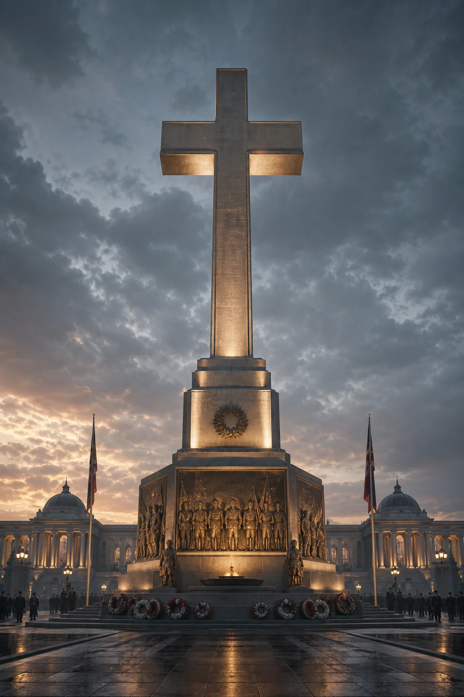
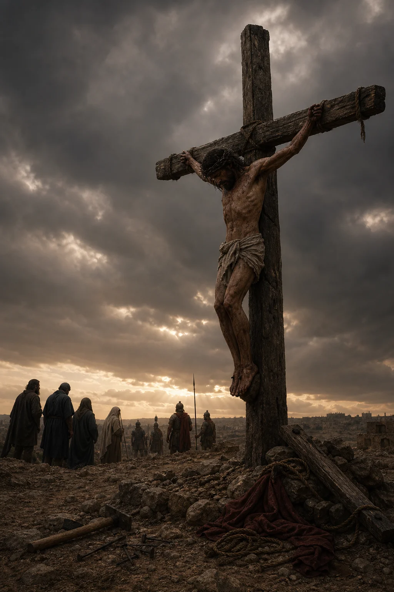

# The Monumental Cross and the Crucified Cross

Status: Draft
Aspect: Political Theology and War
Related aspects: Visual Theology, The Chemical Temple, Fallen Liturgies, Restoration

## Scripture

Primary texts for development:

- Mark 15:16-39
- Luke 23:26-49
- John 19:16-37
- Isaiah 52:13-53:12
- 1 Corinthians 1:18-25
- Colossians 2:13-15
- Hebrews 13:11-13
- Revelation 5:6-14

## Working Thesis

The monumental cross is the cross after power has buried the body beneath meaning.
The crucified cross is what returns when the wounded body of Christ is allowed to
interrupt the monument.

Scripture refuses to make the cross merely decorative. Mark presents a public
execution: Jesus is mocked by soldiers, stripped, crowned in parody, exposed between
criminals, and turned into a religious taunt (Mark 15:16-32). John keeps thirst,
pierced flesh, blood and water, and maternal grief before the reader (John 19:25-37).
Paul then insists that this event remains scandal to religious wisdom and political
power (1 Corinthians 1:18-25).

War monuments often perform a similar conversion. The torn body of the soldier is
translated into stone, bronze, flag, inscription, honor, and civic continuity. The
horror does not disappear; it is made obedient to the monument. The church can do
something similar with the cross. It can preserve crucifixion as symbol while
cleansing it of shame, bodily terror, political scandal, and accusation against
religious and imperial power.

This essay asks how Christianity learned to exchange the crucified cross for the
monumental cross, and what it would mean to face the crucified cross without cleaning
it first.

## Visual Pair

*The monumental cross: the cross as polished civic memorial, with the body hidden
beneath stone, ceremony, and public honor.*

*The crucified cross: the cross returned to the exposed body, public shame, and
judgment of the powers.*

## Core Distinction

The monumental cross is the cross captured by memory, architecture, nation, liturgy,
empire, market, and taste. It is not false simply because it is beautiful, public, or
crafted. Beauty can witness truly. Public signs can honor the Lord. The danger is
more specific: the monumental cross becomes false when its beauty learns to hide the
body.

The New Testament does not let the cross become a placeless religious object.
Hebrews says Jesus suffered outside the gate and calls the faithful to go to him
there, bearing his reproach (Hebrews 13:11-13). The cross is therefore not only a
sign to be installed at the center of respectable life. It is also the place outside
the camp, where holiness appears among the shamed, condemned, and excluded.

The monumental cross:

- preserves the sign while managing the wound
- converts torture into honor before horror can speak
- treats the cross as emblem instead of exposure
- makes the crucifixion available to the powers it judges
- invites reverence without repentance
- changes the crucified one into an ornament of the civilization that crucifies

The crucified cross restores the sign to the event it signifies: a condemned body,
public torture, religious complicity, imperial spectacle, failed discipleship,
maternal grief, and divine presence among the disposed-of.

The Gospels force all of these elements into view. Pilate represents Roman order.
The soldiers represent state violence. The chief priests and scribes represent
religious speech turned against the one it should have recognized. The disciples'
flight reveals the failure of the community around Jesus. The women and the mother
of Jesus preserve the grief public theology often tries to manage (Mark 15:40-41;
John 19:25-27).

The crucified cross is not a more graphic object solved by adding blood, bruises, and
agony. It is the cross before the wound has been translated into safe meaning. It
does not say, "Look how meaningful suffering is." It says: this is what the world
does to God when God appears among the disposable.

Yet the crucified cross does not abandon the disposable to the systems that consume
them. Colossians names the cross as the place where God disarms the rulers and
authorities (Colossians 2:13-15). Revelation shows the enthroned victor as a Lamb
who still appears as slain (Revelation 5:6-14). Glory does not erase the wound.
Glory reveals the wound as judgment of the powers and beginning of restoration.

## War Monuments as Analogy

The war monument is a liturgical machine. It trains the public body to see death
through an authorized grammar by managing the visibility of flesh.

The soldier's torn body is usually hidden. In its place stands stone, bronze,
uniform, inscription, flag, flame, column, arch, or heroic motion. The body is not
presented as ruined body. It is presented as noble sacrifice. The viewer receives
the approved emotional sequence: solemnity, gratitude, pride, grief, continuity,
resolve.

The monument may tell the truth about courage while hiding the truth about
mutilation. It may honor the dead while protecting the living from the full knowledge
of what the political order demanded from those bodies.

The monumental cross works by a similar grammar. The body of Christ is not
necessarily denied. It is translated into a sign that can be hosted by the same forms
of power Christ exposes. That is why Paul refuses to let the cross become another
token of religious prestige or civic wisdom. When a culture can display the cross
without being disturbed by the crucified, the sign has begun to function
monumentally.

## Disordered Logos

The Disordered Logos of the monumental cross is the false story that sacred violence can
be made clean if it is assigned sufficient meaning.

Its claims may include:

1. Suffering becomes holy when the right institution narrates it.
2. A body can be broken for the sake of the whole without accusing the whole.
3. Honor can redeem horror without repentance.
4. Public reverence can substitute for truth.
5. The symbol can be preserved after the victim has been made harmless.
6. The cross can bless the civilization that crucifies.

This false logos does not need to deny Christ. It only needs to curate him. It can
speak fluent Christian language: sacrifice, atonement, glory, victory, peace,
obedience, and love. But these words become diseased when they detach the cross from
the tortured body and from the powers that performed the torture.

Isaiah's servant song guards this distinction. The servant is not honored because
violence is beautiful. He is despised, rejected, wounded, and numbered with
transgressors; the text does not let the reader bypass disfigurement on the way to
meaning (Isaiah 52:13-53:12). Christian interpretation may speak of atonement, but
not by making the suffering body disappear.

## Place in the Architecture of Apostasy

The monumental cross belongs near the center of the architecture of apostasy because
it permits the church to keep the sign of the murdered God while making peace with
the murderers.

Colossians makes this compromise impossible. The cross is not only the place where
sins are forgiven; it is the place where the powers are exposed and disarmed
(Colossians 2:13-15). A church that uses the cross to bless domination, war,
coercive order, or respectable cruelty has not merely misunderstood a symbol. It has
attempted to recruit the sign of Christ's victory into the service of the powers
Christ judged.

The pattern can be mapped this way:

1. Gift: God gives the cross as the place where Christ exposes sin, bears violence,
   disarms the powers, and opens restoration.
2. Reception: the church receives the cross as scandal, salvation, judgment, and
   hope.
3. Institutionalization: the cross becomes public sign, liturgical center,
   devotional image, architectural form, and mark of identity.
4. Externalization: the sign becomes separable from repentance, enemy-love, and
   solidarity with the condemned.
5. Idolatrous capture: the cross is used to bless empire, nation, conquest,
   hierarchy, respectability, and sacrificial violence.
6. Prophetic exposure: the crucified Christ interrupts the monument by returning as
   victim, judge, and risen Lord.
7. Restoration: the cross is received again not as an ornament of power, but as the
   place where power is judged and mercy is opened.

Apostasy does not have to remove the cross. It can polish it.

## The Chemical Temple

The monumental cross forms the Chemical Temple by training the nervous system to
metabolize horror into reverence without revolt.

The viewer may be permitted solemnity, awe, gratitude, patriotic grief, devotional
warmth, guilt, and relief. But the viewer is protected from disgust, accusation,
rage at injustice, grief for the tortured, and solidarity with the publicly shamed.
The body feels that something holy has happened, but holiness has been routed around
the actual body of the crucified. The wound is made useful. The symbol becomes a
sedative.

The crucified cross reforms the Chemical Temple by asking the body to remain present
before exposed flesh, public humiliation, thirst, fear, abandonment, maternal grief,
religious collaboration, imperial competence, and divine forgiveness without
beautifying the violence.

This is not a demand for morbid fascination. The Gospels do not linger over gore,
but neither do they permit spiritualized avoidance. They give enough bodily detail
to prevent abstraction: thirst, naked exposure, mocking, abandonment, piercing,
blood, water, burial (Mark 15:24-39; John 19:28-42). The body learns truthful
worship by remaining present to what love endured and what power did.

## Visual Theology

The visual question is not simply whether a cross has a corpus or whether the corpus
is bloody enough.

A crucifix can become monumental if the body is aestheticized into pious distance.
An empty cross can witness truly if it remains accountable to the crucified and
risen body of Christ. The issue is whether the image allows the wound to accuse,
reveal, and restore.

Revelation's vision of the Lamb is decisive. The victorious one is worshiped as the
one who was slain (Revelation 5:6-14). Christian art is not required to reproduce
violence graphically, but it is required to remain accountable to the slain Lamb. An
image fails when it makes glory available without the wound or makes the wound
available without resurrection.

Questions for visual discernment:

1. Does the image make the body of Christ visible or harmless?
2. Does beauty deepen truth or conceal it?
3. Does the image expose the powers or bless them?
4. Does it invite repentance, solidarity, and worship, or only solemn admiration?
5. Does resurrection arrive as God's vindication of the victim, or as the monument's
   final polish?

## Toward a Crucified Imagination

A church that accepts the crucified cross must recover a crucified imagination. It
must recognize the difference between reverence and concealment, beauty and
anesthesia, atonement and abstraction. It must ask whether its architecture,
preaching, politics, national symbols, and devotional habits allow the body of Jesus
to interrupt them.

To face the crucified cross is to refuse every liturgy that turns victims into usable
meaning too quickly. It is to stand near Mary, the beloved disciple, the watching
women, and the condemned body of Jesus without rushing to make the scene useful
(John 19:25-27). It is to receive forgiveness without letting forgiveness become a
veil over the violence being forgiven.

The crucified cross is not a command to stare endlessly at agony. It is the place
where false sacrifice is exposed, the powers are disarmed, the victim forgives
without beautifying the violence, and God begins the restoration of the world from
inside the wound.

The monumental cross does not abolish the crucifixion. It curates it. The crucified
cross returns when the body is allowed to interrupt the monument.

## Further Development Notes

Potential conversation partners:

- Scripture on crucifixion, scandal, powers, and the Lamb who was slain
- early Christian interpretation of the cross as shame and victory
- political theology of sacrifice, memory, and empire
- visual theology of crucifixion and iconography
- theology of the body, trauma, grief, and embodied worship
- war memorial studies and public memory
- Girard on scapegoating and the victim
- Bonhoeffer on costly discipleship and the visible church
- Augustine and Aquinas on just war, rightly ordered love, and public authority

Research guardrails:

- Distinguish biblical teaching from historical theology and speculative synthesis.
- Do not reduce the Chemical Temple to neurochemistry or medical claim.
- Do not treat all public crosses as apostate by default.
