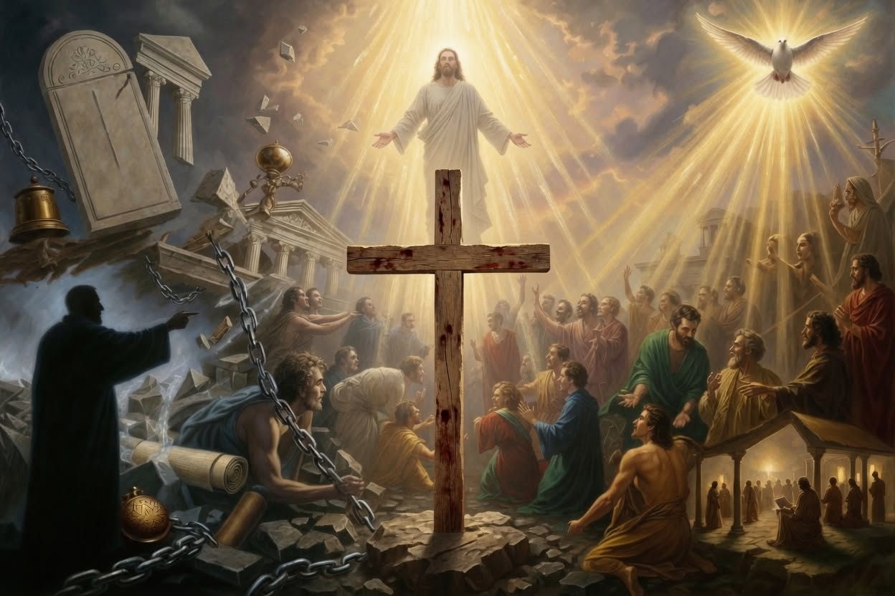

# The Sin Leading to Death: Apostasy, the Blasphemy of the Holy Spirit, and the Final Hardening of the Human Will

Source: `raw/The Sin Leading to Death.pdf`

In the closing chapter of his first epistle, the apostle John issues one of the most solemn
pastoral directives in the entire New Testament. Writing to a community already under pressure
from false teachers, he draws a stark distinction between two categories of sin and the
corresponding responses the church must make:
> If anyone sees his brother committing a sin not leading to death, he shall ask and God will for
him give life to those who commit sin not leading to death. There is a sin leading to death; I do
not say that he should make request for this. All unrighteousness is sin, and there is a sin not
leading to death. (1 John 5:16–17, LSB)
This is not a peripheral curiosity or an obscure theological puzzle. It stands at the intersection of
several of the most serious themes in Scripture: the nature of apostasy, the unforgivable
blasphemy against the Holy Spirit, the limits of intercessory prayer, the reality of irreversible
spiritual hardening, and the pastoral boundaries of church discipline. When the full witness of
the New Testament is allowed to speak, and when that witness is read against the background
of the Old Testament sacrificial system and the earliest post-apostolic tradition, the meaning
becomes unmistakably clear. The “sin leading to death” is the willful, persistent, and final
rejection of the gospel by one who has already known the truth, shared in the life of the
covenant community, and then deliberately inverted and repudiated the testimony of the Holy
Spirit concerning Jesus Christ. It is spiritual death already entered, not merely threatened. And
because the only divine Agent capable of producing repentance has been finally refused,
ordinary intercession is no longer appropriate.
### The Immediate Context of 1 John
John writes against a background of secession and heresy. Earlier in the letter he has already
identified the crisis: “They went out from us, but they were not really of us; for if they were of us,
they would have remained with us; but they went out, so that it would be manifested that they all
are not of us” (1 John 2:19, LSB). These were not outsiders attacking the church from
paganism. They were insiders who had once participated in the life of the community, claimed
the name of Christ, and then departed, denying that Jesus Christ had come in the flesh (1 John
4:2–3). John repeatedly insists that such denial is the spirit of antichrist. The “brother” of 1 John
5:16 must therefore be understood against this backdrop. The term *adelphos* can refer to a
visible member of the covenant community—someone still socially and ecclesiastically
recognized as belonging—whose continuous pattern of high-handed sin finally reveals that he
never truly possessed the life of God.
The grammar of the passage reinforces the distinction. The present active participle
*hamartanonta* describes ongoing, characteristic behavior rather than a single isolated act.
John is not speaking of a believer who momentarily falters under temptation. He is describing a
person whose present life is defined by a particular trajectory of sin. The preposition *pros*

(“toward” or “unto”) attached to *thanaton* indicates direction and destination. Some sins move
the sinner away from intimate fellowship but still leave him within the reach of restoring grace.
Other sins move irreversibly toward final spiritual destruction.
A further linguistic subtlety appears in the verbs for prayer. For the sin not leading to death John
uses *aitēsei*, the ordinary term for petition. For the sin leading to death he refuses *erōtēsē*,
the stronger verb of authoritative request that, in the Johannine corpus, is reserved almost
exclusively for Jesus’ own intercession with the Father (John 17). Ordinary believers simply do
not possess the standing to override a person’s sovereign, settled rejection of the Spirit’s
testimony.
### The Unforgivable Blasphemy of the Holy Spirit
The conceptual heart of the sin leading to death is identical with the blasphemy against the Holy
Spirit. Jesus’ own words leave no ambiguity. In Matthew 12:31–32 (LSB) He declares:
> Therefore I say to you, any sin and blasphemy shall be forgiven people, but the blasphemy
against the Spirit shall not be forgiven. And whoever speaks a word against the Son of Man, it
shall be forgiven him; but whoever speaks against the Holy Spirit, it shall not be forgiven him,
either in this age or in the age to come.
The parallel in Mark 3:28–29 (LSB) is equally absolute: “Truly I say to you, all sins shall be
forgiven the sons of men, and whatever blasphemies they utter; but whoever blasphemes
against the Holy Spirit never has forgiveness, but is guilty of an eternal sin.”
The context is decisive. The Pharisees had just witnessed the unmistakable work of the Spirit in
Jesus’ casting out of demons and had attributed that work to Beelzebul. They had seen the light
and called it darkness. Because the Spirit is the one who convicts the world of sin,
righteousness, and judgment (John 16:8–11), a final, malicious rejection of the Spirit’s testimony
leaves the sinner with no remaining capacity for repentance. The sin is not unforgivable
because God has arbitrarily decided to withhold mercy; it is unforgivable because the only
means by which a human heart can be turned has been permanently refused. The sin leading to
death in 1 John is simply this same reality viewed from the pastoral side: once a person has
crossed that threshold, the church is no longer to intercede as though restoration remains
possible.
### Old Testament Roots: High-Handed Sin and the Refusal of Intercession
John’s distinction does not arise in a vacuum. It is the New Testament extension of a principle
already clear in the Torah. Leviticus 4 carefully provides sacrificial atonement for sins committed
“unintentionally” or in ignorance. Numbers 15:30–31 draws the sharp contrast:
> But the person who does anything with a high hand, whether he is native or a sojourner, that
one is blaspheming Yahweh; and that person shall be cut off from among his people. Because

he has despised the word of Yahweh and has broken His commandment, that person shall be
completely cut off; his guilt will be on him. (LSB)
The Hebrew expression “with a high hand” (*beyad ramah*) evokes the image of a raised
fist—defiant, conscious, insolent rebellion against known commandment. For such sin no
sacrifice was appointed. The penalty was excision from the covenant community, and ultimately
death.
The prophetic books intensify the same principle. Three times Yahweh forbids Jeremiah to
intercede for a people whose idolatry has hardened past the point of return: “As for you, do not
pray for this people, and do not lift up a cry or prayer for them, and do not plead with Me; for I
will not listen to you” (Jeremiah 7:16; cf. 11:14; 14:11). When the heart has been given over to
persistent, high-handed rejection of the light it has received, intercession is no longer
appropriate. John’s instruction in 1 John 5:16 stands in direct continuity with this prophetic
pattern.
### The Minority View of Physical Death
A minority interpretation has suggested that the “sin leading to death” refers to a genuine
believer whose particular offense is so serious that God removes him from this life as an act of
disciplinary judgment. Support is drawn from Ananias and Sapphira (Acts 5:1–11) and from
Paul’s statement that some in Corinth had become weak, sick, and had “fallen asleep” because
of their abuse of the Lord’s Table (1 Corinthians 11:29–32). While these passages demonstrate
that God may indeed chasten His people even unto physical death, they do not adequately
explain John’s language. The apostle does not say that God may take the life of the sinner; he
says that the sin itself is “leading to death” and that the believer is not to make request for it.
Moreover, the broader context of 1 John is concerned with spiritual life and death, with
remaining in the truth versus going out into the darkness of antichrist. The early church, as we
shall see, consistently read the passage in spiritual rather than merely physical terms.
### The Earliest Christian Witness
The post-apostolic writers confirm that the first generations of the church understood the sin
leading to death as final apostasy and blasphemy against the Spirit. The *Didache* (late first or
early second century) already links the unforgivable sin to the testing or rejection of a prophet
speaking in the Spirit. The *Shepherd of Hermas* (early second century), one of the most widely
read Christian texts of the period, wrestles extensively with the problem of post-baptismal sin. It
allows for one opportunity of repentance after baptism for those who fall into moral failure, but it
draws an absolute line at total apostasy, blasphemy, and the betrayal of the servants of God.
For such persons, Hermas is told, repentance is no longer available; they have become
spiritually dried up and dead.
Clement of Alexandria (c. 150–215) explicitly ties 1 John 5 to the distinction between sins of
weakness and willful spiritual rebellion. Regular sins of ignorance or sudden passion meet with

mercy; those who stubbornly persist in a lifestyle of opposition to the truth after having received
the knowledge of it have chosen a path that leads directly to destruction. Tertullian, writing in
*On Purity* (*De Pudicitia*), is even more explicit. He quotes Hebrews 6:4–6 at length and
immediately pairs it with 1 John 5:16, arguing that John’s “sin unto death” is precisely the
apostasy that the author of Hebrews declares impossible to renew to repentance. For Tertullian,
major willful crimes such as idolatry, adultery, and murder after baptism fell into this category,
and the church had no authority to grant absolution for them.
The third-century Novatian controversy only sharpened the issue. During the Decian
persecution many Christians lapsed under pressure and denied Christ. The Novatianists,
appealing to Hebrews 6 and 1 John 5, insisted that such denial constituted the sin leading to
death and that the church possessed no power to readmit the *lapsi*. The wider church
ultimately moderated the practical application, arguing that genuine, deep fruits of repentance
demonstrated that the irreversible threshold had not yet been crossed. Yet both sides agreed on
the underlying principle: true, settled, unrepentant apostasy places a person beyond the
ordinary means of ecclesiastical restoration.
### The Unified Testimony of Hebrews
Hebrews 6:4–6 and 10:26–29 describe the same spiritual reality from a complementary angle.
The former passage speaks of those who have been “enlightened,” have “tasted of the heavenly
gift,” have “become partakers of the Holy Spirit,” and have “tasted the good word of God and the
powers of the age to come,” yet have “fallen away.” For such it is “impossible to renew them
again to repentance, since they again crucify to themselves the Son of God and put Him to open
shame” (LSB). Hebrews 10:26–29 intensifies the warning:
> For if we go on sinning willfully after receiving the knowledge of the truth, there no longer
remains a sacrifice for sins, but a terrifying expectation of judgment and the fury of a fire which
will consume the adversaries. ... How much worse punishment do you think he will deserve who
has trampled underfoot the Son of God, and has regarded as defiled the blood of the covenant
by which he was sanctified, and has insulted the Spirit of grace?
The shared conceptual framework is unmistakable. Both texts describe people who possessed
full access to the covenant community and the experiential benefits of the Spirit, yet who then
willfully abandoned and inverted the truth. The consequence in both cases is the same: no
remaining sacrifice, no possibility of renewal, and a terrifying expectation of judgment. The early
church therefore read 1 John 5 and Hebrews 6 as mutually interpreting witnesses to a single,
solemn reality.
### Cerinthus and the Historical Face of the Sin
The concrete historical setting of John’s epistles makes the abstract principle painfully specific.
Cerinthus, a late-first-century teacher in Asia Minor, was regarded by the early tradition as
John’s chief antagonist. Irenaeus, drawing on the oral tradition of Polycarp (who had known

John personally), records that John once fled a public bathhouse in Ephesus upon discovering
Cerinthus inside, exclaiming that the building might collapse because “Cerinthus, the enemy of
the truth,” was present.
Cerinthus’s doctrine was a direct assault on the apostolic confession. He taught that Jesus was
a mere man, the natural son of Joseph and Mary, upon whom the divine “Christ” descended as
a dove at baptism. This Christ-Spirit empowered Jesus for ministry and then departed before
the crucifixion, so that only the human Jesus suffered and died. The divine Christ remained
impassible. In one stroke Cerinthus denied the genuine incarnation, emptied the cross of its
divine significance, and contradicted the unified testimony of the Spirit, the water, and the blood
(1 John 5:6–8).
John’s letter functions as a sustained polemical counter-attack. He insists that “this is the One
who came by water and blood, Jesus Christ; not with the water only, but with the water and with
the blood” (1 John 5:6, LSB). The emphatic denial of “the water only” is a direct refutation of the
Cerinthian separation. He democratizes the “anointing” (*chrisma*) so that every true believer
already possesses the knowledge that exposes the counterfeit (1 John 2:20, 27). He establishes
the confession that “Jesus Christ has come in the flesh” as the litmus test that separates the
Spirit of God from the spirit of antichrist (1 John 4:2–3). And he anchors everything in “that
which was from the beginning”—the tangible, eyewitness reality of the incarnate Word that the
apostles had heard, seen, and touched (1 John 1:1).
To teach such a doctrine after having known the apostolic gospel was, in the judgment of the
early church, to commit the high-handed blasphemy against the Spirit’s testimony. It was to
crucify the Son of God afresh and hold Him up to open shame. It was the sin leading to death.
### The Three Defining Conditions
From the combined witness of Scripture and the earliest tradition, three conditions emerge with
clarity:
1. **High-handed awareness.** The person has received “the knowledge of the truth” (Hebrews
10:26), has been enlightened, has tasted the heavenly gift, and has shared in the Holy Spirit.
Ignorance is no longer possible. The sin is committed against light deliberately refused.
2. **Covenant-insider status.** The person has been a visible participant in the life of the
community—baptized, addressed as brother, partaking of the Table. Apostasy is possible only
for those who have first stood inside the covenant circle.
3. **Active malice and structural deception.** The denial is not a private struggle with doubt or a
moral collapse under pressure. It is an aggressive inversion of the gospel, often accompanied
by the recruitment of others into the deception and the public declaration that the Spirit’s
testimony is a lie.

When these three conditions converge, the human heart is cauterized. The Spirit who alone
produces repentance has been finally insulted and rejected. The state becomes unalterable.
### Pastoral Boundaries: Restoration versus Excision
The early church carefully distinguished this irreversible condition from ordinary discipline. In 1
Corinthians 5 Paul confronts a man living in open incest. His command is severe: “deliver such
a one to Satan for the destruction of his flesh, so that his spirit may be saved in the day of the
Lord” (1 Corinthians 5:5, LSB). The goal remains restorative. When the man later demonstrates
genuine grief, Paul urgently orders the church to forgive and comfort him lest he be
“overwhelmed by excessive sorrow” and Satan gain the advantage (2 Corinthians 2:6–11). The
presence of a soft, repentant heart proves that the sin was not unto death.
The supreme historical object lesson is the contrast between Peter and Judas. Both men stood
inside the innermost circle of Jesus’ disciples. Both possessed full awareness of His identity.
Both committed catastrophic sins on the same night. Yet the early fathers consistently treated
Peter as the model of restorative discipline and Judas as the prototype of the unforgivable
apostate.
Judas’s betrayal was premeditated, rooted in long-standing greed (John 12:6), and carried out
with calculated malice. When remorse finally came, it led not to *metanoia*—gospel
repentance—but to despair and suicide. He became, in Jesus’ own words, “the son of
destruction” (John 17:12). Peter’s threefold denial, by contrast, was a collapse under sudden
fear. The Lord’s look produced bitter weeping (Luke 22:62). Jesus had already anticipated the
failure and prayed for him: “Simon, Simon, behold, Satan has demanded to sift all of you like
wheat. But I have prayed earnestly for you, that your faith may not fail; and you, once you have
returned, strengthen your brothers” (Luke 22:31–32, LSB). The capacity for broken-hearted
turning marked the decisive difference.
Augustine later summarized the principle with characteristic clarity: the sin unto death is “an
implacable hardness of heart up to the very end of life.” John Chrysostom insisted that it is not
the magnitude of the outward act alone that seals a person’s fate, but the posture of the will
toward repentance. As long as a person retains the capacity for genuine, Spirit-wrought grief
over sin, the threshold of the unforgivable has not been crossed.
### Conclusion
The biblical teaching is neither obscure nor uncertain. The sin leading to death is the final,
willful, high-handed apostasy of one who has known the truth, shared in the gifts of the Spirit,
and then deliberately repudiated the Spirit’s testimony concerning the incarnate, crucified, and
risen Son of God. It is identical with the blasphemy against the Holy Spirit. It is the same reality
described in Hebrews as the impossibility of renewal after enlightenment and tasting. It was
recognized by the earliest Christian writers as the settled hardness that places a person beyond
intercession. Ordinary moral failures, even severe ones, remain within the reach of restorative

discipline and prayer. But when full light, covenant privilege, and active malice combine,
Scripture speaks with one voice: there is a sin leading to death, and for that sin the church is not
to make request.
The warning is severe precisely because the gospel is so great. The same Spirit who can be
finally insulted is the Spirit who still convicts, regenerates, and keeps all who truly belong to
Christ. The same Christ who can be trampled underfoot is the Christ whose blood still cleanses
from all sin those who walk in the light. The existence of an irreversible threshold does not
diminish the freeness of grace; it magnifies the urgency of responding to the light while it is still
given. “Today if you hear His voice, do not harden your hearts” (Hebrews 3:15).​
​

