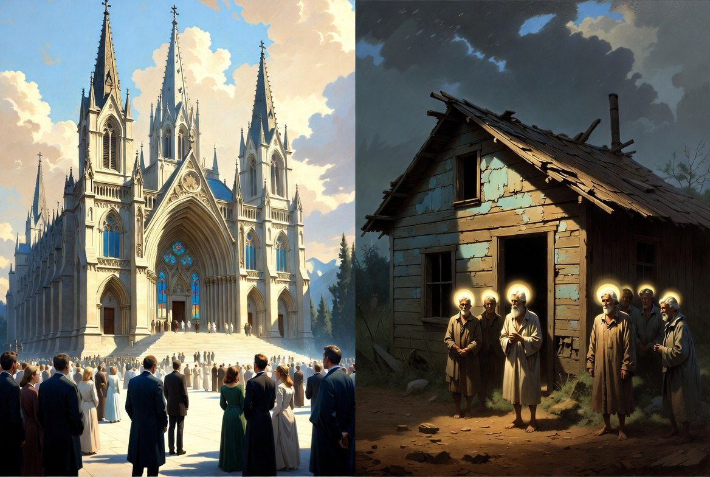

# The Whitewashed Cathedral and the Hidden Upper Room: A Polemic on Ecclesiastical Grandeur, Scattered Faith, and the Idolatry of Images

Source: `raw/The Whitewashed Cathedral.pdf`

Throughout the history of God’s people, a consistent and often tragic inversion has appeared: the more religious institutions accumulate worldly prestige, architectural splendor, and visible forms meant to represent heavenly realities, the more frequently their spiritual life withers. At the same time, the most vital expressions of faith have repeatedly been found among small, scattered gatherings of believers who possess little in the way of impressive structures or sacred objects. They meet in homes, fields, or hidden places, relying not on visible representations but on the living presence of Christ revealed to the heart.

This inversion is not accidental. It reflects a fundamental spiritual conflict between two opposing orientations: one that seeks to bring Heaven down to earth through material forms, and another that lives by faith in the unseen, allowing Christ to reveal Himself directly and daily to those who walk by the Spirit rather than by sight.

### **The Scriptural Prohibition Against Images**

Scripture does not treat the making of religious images as a neutral or helpful practice. It presents it as a fundamental violation of the nature of God and the nature of true worship.

When God gave the law at Sinai, the second commandment was explicit:

“You shall not make for yourself a carved image, or any likeness of anything that is in heaven above, or that is in the earth beneath, or that is in the water under the earth. You shall not bow down to them or serve them…” (Exodus 20:4–5)

Moses later reminded Israel of the reason for this prohibition:

“Therefore watch yourselves very carefully. Since you saw no form on the day that the Lord spoke to you at Horeb out of the midst of the fire, beware lest you act corruptly by making a carved image for yourselves, in the form of any figure, the likeness of male or female…” (Deuteronomy 4:15–16)

God had deliberately revealed Himself without a visible form. To then create an image was not to honor Him but to corrupt the revelation. The prophets returned to this theme with withering sarcasm. Isaiah exposed the absurdity of crafting an image of the transcendent God with human hands:

“To whom then will you liken God, or what likeness compare with him? An idol\! A craftsman casts it, and a goldsmith overlays it with gold and casts for it silver chains… He cuts down cedars… Half of it he burns in the fire… and the rest of it he makes into a god, his idol, and falls down to it and worships it.” (Isaiah 40:18–20; see also Isaiah 44:9–20)

The Apostle Paul echoed the same conviction when speaking to the philosophers in Athens:

“Being then God’s offspring, we ought not to think that the divine being is like gold or silver or stone, an image formed by the art and imagination of man.” (Acts 17:29)

And again in his letter to the Romans, he described the fundamental human rebellion as exchanging “the glory of the immortal God for images resembling mortal man and birds and animals and creeping things” (Romans 1:23). The core issue is not merely the misuse of images, but the attempt itself to make the invisible God visible through human craftsmanship.

Jesus reinforced this orientation when He said to Thomas, after the resurrection:

“Have you believed because you have seen me? Blessed are those who have not seen and yet have believed.” (John 20:29)

The blessing rests not on those who possess a visible representation, but on those who believe without one. The New Testament consistently directs believers away from visible mediators toward direct, Spirit-enabled encounter:

“God is spirit, and those who worship him must worship in spirit and truth.” (John 4:24)  
“For we walk by faith, not by sight.” (2 Corinthians 5:7)

“Set your minds on things that are above, not on things that are on earth.” (Colossians 3:2)

### **The Stark Choice: Earth or Heaven**

At root, the use of religious images represents a choice to dwell upon the earth rather than to live in light of Heaven. It is an attempt to distill transcendent, spiritual reality into something tangible, visible, and controllable. Instead of waiting upon the living Christ to reveal Himself daily to the heart of the believer through the Spirit and the Word, the image attempts to “pin Christ down”—to fix Him in wood, paint, or stone so that He can be approached on human terms.

This is not a minor aesthetic preference. It is a fundamental reorientation of worship from the unseen to the seen, from faith to sight, from the heavenly to the earthly. The image claims to make Heaven more accessible, but in doing so it domesticates the transcendent and substitutes a human-made representation for the direct, often uncomfortable, and always humbling encounter with the living God.

Throughout history, this choice has repeatedly produced the same results. When the early Church met in simple house gatherings with no images and no dedicated sacred spaces, it spread under persecution with remarkable spiritual power. When Christianity later acquired imperial favor and began constructing grand basilicas filled with images, it gained worldly prestige but often lost the sharp edge of costly discipleship and direct dependence upon the Spirit. The same pattern has appeared in multiple traditions and centuries: the more elaborate the visible apparatus of religion—buildings, images, rituals, and institutional grandeur—the more frequently the vital, heart-level reality of walking with the risen Christ has receded.

In our own time, the contrast remains stark. Some of the most visually impressive religious environments, whether ancient cathedrals heavy with iconography or modern facilities designed for aesthetic and emotional impact, can coexist with shallow faith and little genuine transformation. Meanwhile, in many places where believers are scattered, poor, and without impressive forms or images, the gospel continues to advance with vitality among those who have nothing to rely upon except the daily revelation of Christ to their hearts.

### **The Persistent Inversion**

The inversion is not primarily about buildings or budgets. It is about whether faith is oriented toward the visible and earthly or toward the invisible and heavenly. Religious images, no matter how beautifully crafted or theologically defended, participate in this inversion by attempting to bring Heaven down to earth and to make the spiritual material. They offer a form that can be seen and touched in place of the living Christ who must be known by faith.

The alternative is not a new form of religion but a return to the New Testament pattern: believers gathered in simplicity, often in weakness and obscurity, who walk by faith and not by sight, who refuse to pin Christ down in graven images, and who instead wait upon Him to reveal Himself daily to the heart. In such gatherings—scattered, humble, and without impressive visible supports—the Spirit has often moved with greatest freedom and power.

The choice remains what it has always been. One path seeks to secure and represent the divine through human craftsmanship and institutional grandeur. The other walks by faith in the unseen, trusting that Christ is able to make Himself known directly to those who seek Him with humble and contrite hearts. History and Scripture together testify that the first path leads to tombs, however beautifully whitewashed. The second path leads to life.
