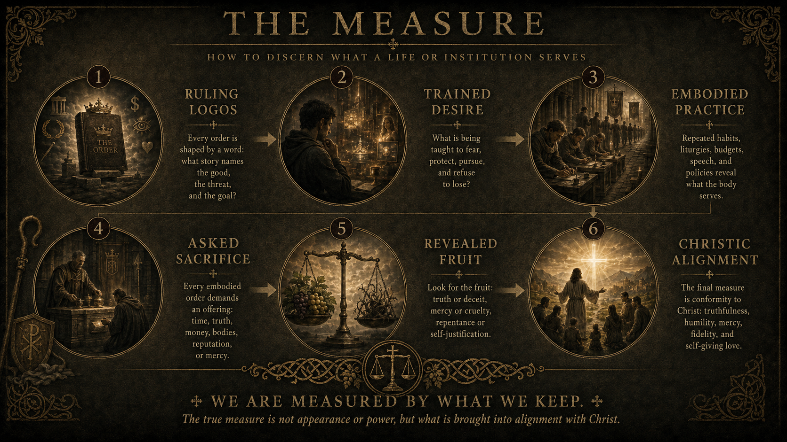

The Measure of Christ names the Christological guardrail for every act of diagnosis, keeping, judgment, and protection in this work.

It asks how to discern what a life or institution serves: the ruling logos, the trained desire, the embodied practice, the demanded sacrifice, the revealed fruit, and the final alignment or misalignment with Christ.

The Measure is held together with [The Path of Re-Embodiment](path.qmd) and [The Keeping of the Troth](keeping.qmd). The Path diagnoses false embodiment; The Keeping trains faithful response; The Measure returns both to Christ as the only final measure.

Christ is the measure. The keeper is not the Shepherd. The Troth is not our possession. The fang is entrusted; it is not a crown.

## The Measure

::: {.troth-poster}
{.troth-poster-bg fig-alt="A dark gold and black poster titled The Measure, showing six stages for discerning what a life or institution serves: ruling logos, trained desire, embodied practice, asked sacrifice, revealed fruit, and Christic alignment."}
:::

## Christ The Measure

The Architecture of Apostasy can name false embodiment only because Christ first reveals true life, true authority, true communion, and true self-giving.

The measure is not the intensity of our critique, the purity of our suffering, the usefulness of our office, the success of our protection, or the force of our conviction. The measure is Christ: the Good Shepherd who lays down his life for the sheep.

Every authority, community, doctrine, institution, vow, symbol, and act of keeping stands beneath that judgment.

## Unclaimed Virtue

[The Doctrine of Unclaimed Virtue](markdown/the-doctrine-of-unclaimed-virtue.md) is the central discipline of The Measure of Christ.

It refuses to let courage, suffering, protection, insight, office, sacrifice, or successful keeping become moral title. A person can name evil without becoming the Good. A community can restrain harm without making its own judgment sovereign.

Unclaimed Virtue is not moral confusion. Good and evil remain real. Harm can be named. The vulnerable can be protected. But every act remains accountable to Christ.

## Dangerous Capacity

The Measure of Christ is especially necessary where real capacity exists: authority, command, knowledge, endurance, discernment, force, charisma, office, inheritance, or the power to guard a boundary.

Those capacities are not abolished by Christ. They are placed under him.

Strength does not create superiority. It creates obligation. The more dangerous the capacity, the more severe the discipline of remaining correctable, repentant, and releasable.

## Read First

1. [The Doctrine of Unclaimed Virtue](markdown/the-doctrine-of-unclaimed-virtue.md)
2. [The Troth Remains: An Essay on John 10](markdown/the-troth-remains-john-10.md)
3. [Aru va`en: A Keeping of the Troth](markdown/aru-vaen-a-keeping-of-the-troth.md)
4. [Core Concepts](core-concepts.qmd)
5. [Method](method.qmd)
